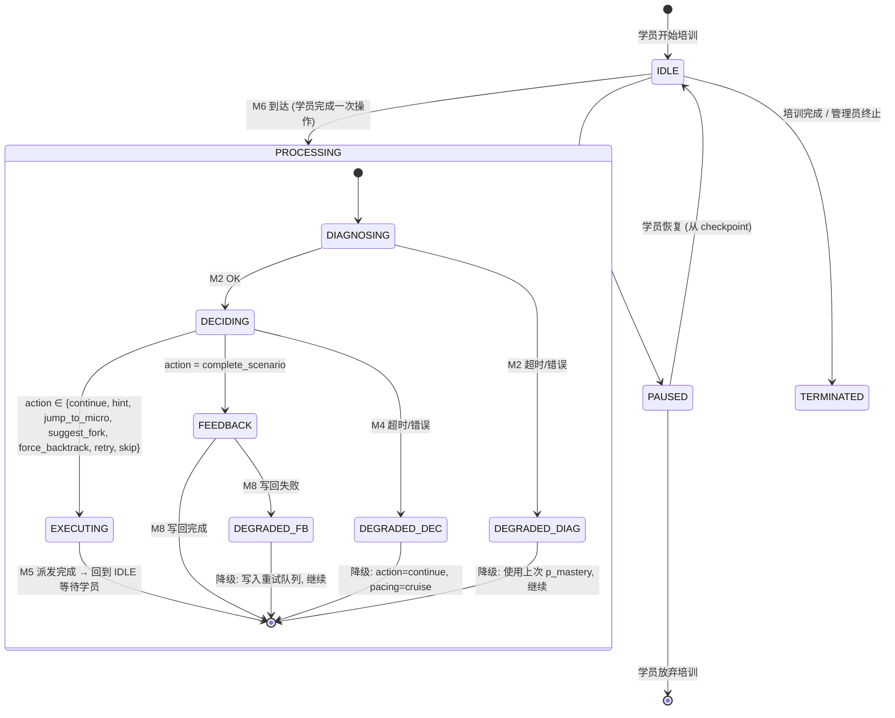
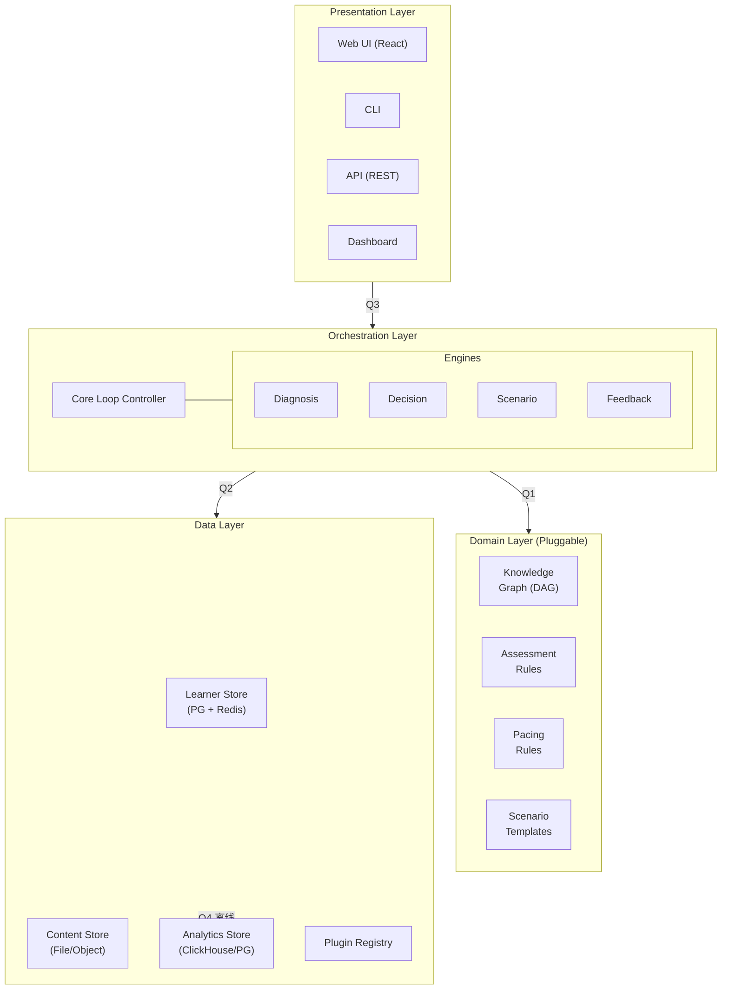
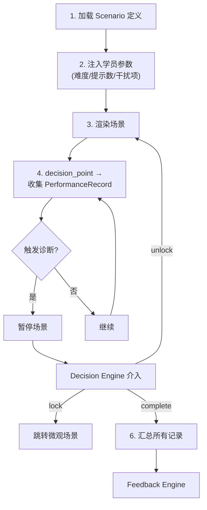
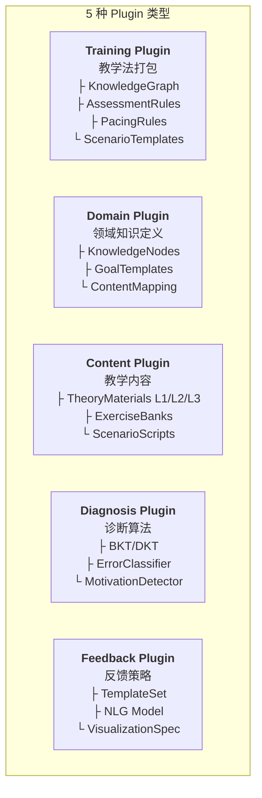
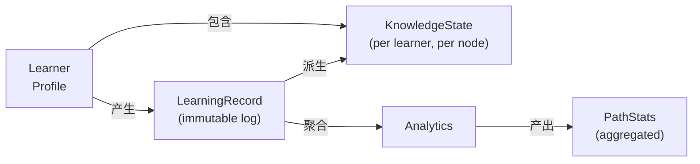
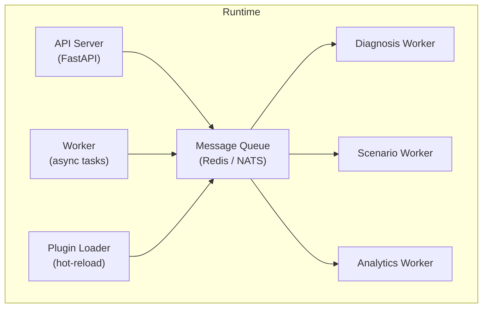

# Architecture — 训练系统架构

> 定义核心训练循环、可扩展点、以及 Training Plugin 的接口规范。

---

## 目录

1. [核心训练循环 (Core Loop)](#1-核心训练循环)
2. [系统分层架构](#2-系统分层架构)
3. [核心组件](#3-核心组件)
4. [可扩展点与 Plugin 系统](#4-可扩展点与-plugin-系统)
5. [Training Plugin 规范](#5-training-plugin-规范)
6. [数据模型](#6-数据模型)
7. [部署与集成](#7-部署与集成)

---

## 1. 核心训练循环 — 状态机定义

核心循环不是线性消息序列，而是一个**有限状态机**。Controller 持有 `SessionState`，每个 Engine 是纯函数（不持有状态），状态转换由消息到达和超时事件驱动。

### 1.1 状态图



### 1.2 状态定义

| 状态 | 含义 | Controller 在做什么 |
|------|------|-------------------|
| `IDLE` | 等待学员操作 | 展示场景/反馈，等待 M6 PerformanceRecord |
| `DIAGNOSING` | M1 已发送，等待 M2 | 阻塞。最长等待 500ms。超时 → DEGRADED_DIAG |
| `DECIDING` | M3 已发送，等待 M4 | 阻塞。最长等待 200ms。超时 → DEGRADED_DEC |
| `EXECUTING` | M5 已派发到 Scenario Engine | 非阻塞。立即返回 IDLE，由 Scenario Engine 异步渲染 |
| `FEEDBACK` | M7 已发送，等待 M8 | 阻塞。最长等待 3s (instant) / 30s (phase/summary)。超时 → DEGRADED_FB |
| `PAUSED` | 学员暂停，checkpoint 已保存 | 释放内存中的热缓存，保留 checkpoint 引用 |
| `DEGRADED_*` | 某组件异常，降级运行 | 使用降级参数，记录 incident，通知管理员 |
| `TERMINATED` | 培训结束 | 写回最终 LearnerModel，关闭 session |

### 1.3 SessionState — Controller 持有的核心数据结构

```yaml
SessionState:
  session_id: string
  learner_id: string
  
  # 状态机
  current: "IDLE" | "DIAGNOSING" | "DECIDING" | "EXECUTING" | "FEEDBACK"
          | "PAUSED" | "DEGRADED_DIAG" | "DEGRADED_DEC" | "DEGRADED_FB" | "TERMINATED"
  previous: string    # 上一个状态（用于恢复）
  
  # 当前正在等待的异步操作
  pending:
    message: "M1" | "M3" | "M5" | "M7" | null
    sent_at: timestamp
    timeout_ms: int
    retry_count: 0
    
  # 降级标记
  degraded:
    active: boolean                # 当前是否在降级模式
    reason: string | null          # 触发降级的原因
    affected_components: [string]  # 哪些组件降级了
    incident_id: string | null     # 关联的 incident
    
  # 检查点（用于暂停恢复和宏观场景锁定）
  checkpoint:
    scenario_id: string | null
    phase_id: string | null
    decision_point_id: string | null
    knowledge_snapshot: object | null
    context_variables: object | null
    saved_at: timestamp | null
    
  # 统计
  stats:
    total_ticks: int               # 总循环次数
    degraded_ticks: int            # 降级次数
    avg_processing_ms: float       # 平均每次 PROCESSING 耗时
```

### 1.4 状态转换规则

```yaml
transitions:
  IDLE_to_PROCESSING:
    trigger: "M6 PerformanceRecord 到达"
    guard: "current == IDLE"
    action: "加载 LearnerModel 热缓存 → 设置 current=DIAGNOSING → 发送 M1"
    
  DIAGNOSING_to_DECIDING:
    trigger: "M2 DiagnosisReport 到达 AND M2 无错误"
    action: "合并 updated_knowledge_state → 设置 current=DECIDING → 发送 M3"
    
  DIAGNOSING_to_DEGRADED_DIAG:
    trigger: "M2 超时 (>500ms) OR M2 ErrorReport"
    action: |
      降级策略:
        - 使用上次 p_mastery（不做 BKT 更新）
        - gap_severity 全部设为 moderate
        - 写入 incident 日志
        - 设置 degraded.active=true
        - 仍然进入 DECIDING（用降级后的 diagnosis）
    
  DECIDING_to_EXECUTING:
    trigger: "M4 Decision 到达 AND action != complete_scenario"
    action: "设置 current=EXECUTING → 发送 M5 → 立即回到 IDLE"
    
  DECIDING_to_FEEDBACK:
    trigger: "M4 action == complete_scenario"
    action: "设置 current=FEEDBACK → 发送 M7"
    
  DECIDING_to_DEGRADED_DEC:
    trigger: "M4 超时 (>200ms) OR M4 ErrorReport"
    action: |
      降级策略:
        - action = continue
        - pacing_mode = cruise
        - rationale = "DEGRADED: Decision Engine unavailable"
        - 进入 EXECUTING
        
  EXECUTING_to_IDLE:
    trigger: "M5 派发完成（场景渲染指令已推送给 Presentation）"
    action: "回到 IDLE，等待学员下一个操作"
    
  FEEDBACK_to_IDLE:
    trigger: "M8 FeedbackOutput 到达 AND 写回 LearnerStore 成功"
    action: "推送反馈给 Presentation → 回到 IDLE"
    
  FEEDBACK_to_DEGRADED_FB:
    trigger: "M8 超时 OR LearnerStore 写回失败"
    action: |
      降级策略:
        - 反馈内容推入重试队列（异步重试 3 次）
        - LearnerModel patch 写入本地 WAL (Write-Ahead Log)
        - 回到 IDLE（学员看不到异常）
        
  IDLE_to_PAUSED:
    trigger: "学员点击暂停"
    action: "保存 checkpoint → 释放热缓存 → 设置 current=PAUSED"
    
  PAUSED_to_IDLE:
    trigger: "学员点击恢复"
    action: "从 checkpoint 恢复 → 加载热缓存 → 回到 IDLE → 重放 WAL 中未写入的 patch"
    
  PAUSED_to_TERMINATED:
    trigger: "学员放弃培训 OR 暂停超过 30 天"
    action: "写回最终 LearnerModel → 关闭 session"
    
  *_to_TERMINATED:
    trigger: "连续降级超过 10 次 OR 管理员强制终止"
    action: "尝试保存 LearnerModel → 通知学员 → 关闭 session"
```

### 1.5 为什么是状态机而不是消息序列

| 消息序列模型能回答的 | 状态机模型额外能回答的 |
|-------------------|---------------------|
| 正常流程每一步的输入输出是什么 | Diagnosis 超时后系统是继续还是卡住？ |
| 消息的字段定义 | 学员在「等待诊断结果」时点了暂停——怎么处理？ |
| Engine 之间的数据依赖 | 连续 3 次降级后系统应该彻底停掉还是继续跑？ |
| | Feedback 写回失败——学员看到的是错误页还是正常反馈？ |
| | 从暂停恢复时，LearnerModel 在暂停期间被 Analytics 更新了——用哪个版本？ |

### 1.6 Engine 的纯函数约束

状态机要求每个 Engine 满足以下约束：

```yaml
constraints:
  - "Engine 不持有任何内部状态 —— 所有状态在 SessionState 中"
  - "Engine 不发起异步操作 —— 输入 → 计算 → 输出，同步完成"
  - "Engine 不访问 Data Layer —— 所需数据由 Controller 在调用前查询好"
  - "Engine 出错时返回 ErrorReport，不抛异常"
  - "Engine 的输出是幂等的 —— 相同输入永远产生相同输出"
```

这确保了：Controller 可以在任何时候重试、回滚、或从 checkpoint 恢复，而不用担心 Engine 的内部状态不一致。

---

## 2. 系统分层架构



---

## 3. 核心组件

### 3.1 Diagnosis Engine (诊断引擎)

**职责**：回答「学员现在会什么、不会什么、为什么不会」

**输入**：PerformanceRecord（操作序列 + 结果）
**输出**：DiagnosisReport

```
DiagnosisReport {
  knowledge_gaps: [
    {
      node_id: "K_break_even",
      p_mastery: 0.32,           // 当前掌握概率
      gap_severity: "critical",  // critical | moderate | minor
      attribution: "concept",    // concept | calculation | comprehension | prerequisite
      prerequisite_gap: "K_cost_structure",  // 如果是前置知识缺失
      evidence: [                 // 支撑证据
        { task_id: "T_203", error_type: "misidentified_problem_type", timestamp: "..." },
        { task_id: "T_207", error_type: "formula_misapplied", timestamp: "..." }
      ]
    }
  ],
  overall_state: {
    current_zone: "stretch",     // comfort | stretch | panic
    motivation_index: 0.72,      // 基于频率、正确率、犹豫时间的综合指标
    recommended_mode: "cruise"   // cruise | assault | recover
  }
}
```

**核心算法**：
- Bayesian Knowledge Tracing (BKT) 作为基线
- Deep Knowledge Tracing (DKT) 作为增强（需要足够数据）
- 错误归因分类器（基于规则的 + ML 模型）
- Q-matrix 驱动的多知识点诊断

---

### 3.2 Decision Engine (决策引擎)

**职责**：回答「下一步该做什么」

**输入**：DiagnosisReport + LearnerModel + TrainingRules + GoalConfig
**输出**：Decision

```
Decision {
  action: "jump_to_micro",  // continue | hint | jump_to_micro | unlock_macro | skip | retry
                             // suggest_fork | force_backtrack | complete_scenario
  target: {
    scenario_id: "micro_break_even_calc",
    difficulty_params: {
      new_old_ratio: 0.35,         // 新知占比
      time_limit: null,
      hints_available: 1
    }
  },
  pacing_mode: "assault",           // cruise | assault | recover
  rationale: "Critical knowledge gap detected on core node K_break_even. 
              Previous 3 attempts failed with concept-level errors. 
              Prerequisites verified OK."
}
```

**决策规则**（来自 TrainingRules）：

| 条件 | 动作 |
|------|------|
| `gap_severity == critical AND is_core_node` | jump_to_micro + assault mode |
| `gap_severity == moderate` | hint（软提示，不锁定场景）|
| `gap_severity == minor` | 记录但不打断，事后回溯 |
| `p_mastery > 0.90 for all prerequisites AND consecutive_correct > 3` | skip / accelerate |
| `motivation_index < 0.3` | 切换到低难度巡航，给正向反馈 |
| `p_mastery < 0.4 AND prerequisite_gap exists` | force_backtrack（回溯前置知识）|
| `inferred_edge exists AND learner_stuck` | suggest_fork（建议探索隐性依赖）|
| `fork_depth > 3 AND pacing_mode == assault` | force_backtrack（限制分叉深度）|
| `scenario all phases completed` | complete_scenario → 进入反馈阶段 |

---

### 3.3 Scenario Engine (场景引擎)

**职责**：加载、参数化、呈现训练场景，记录学员交互

**场景类型**：

```
Scenario {
  type: "macro" | "micro" | "quiz" | "sandbox"
  
  // 场景结构（以 macro 为例）
  phases: [
    {
      id: "phase_1_context",
      description: "场景背景介绍 + 角色设定",
      knowledge_nodes: ["K_market_analysis"],  // 该阶段涉及的知识点
    },
    {
      id: "phase_2_decisions",
      description: "学员做出一系列战略决策",
      decision_points: [
        {
          id: "decision_3_pricing",
          triggers_diagnosis: true,            // 该决策点触发诊断
          knowledge_tested: ["K_break_even", "K_pricing_strategy"],
          acceptable_correctness: 0.70,        // 低于此 → 触发缺口
        }
      ]
    }
  ],
  
  // 关联的微观场景（当某个决策点触发缺口时跳转）
  micro_scenarios: {
    "K_break_even": "micro_break_even_calc",
    "K_pricing_strategy": "micro_pricing_models"
  }
}
```

**场景执行流程**：



---

### 3.4 Feedback Engine (反馈引擎)

**职责**：将原始表现数据转化为学员可理解的、可操作的反馈

**反馈层次**：

| 层次 | 时机 | 内容 |
|------|------|------|
| **即时反馈** | 单个任务完成后（< 5 秒） | 对/错 + 简短提示 |
| **阶段反馈** | 知识单元完成后 | 掌握度变化 + 薄弱点 + 建议 |
| **总结反馈** | 宏观场景完成后 | 多维度雷达图 + 进步轨迹 + 下一步建议 |
| **证书/报告** | 整个培训完成后 | 综合评估 + 结业证书 + 薄弱模块列表 |

**反馈生成管道**：

```
PerformanceRecord → 归因分析 → 模板选择 → 自然语言生成 → 个性化 → Feedback
                        ↓
                   LearnerModel Update (write back)
```

---

### 3.5 Learner Model (学员模型)

**职责**：系统对学员的完整内部表征

```
LearnerModel {
  id: "learner_123",
  goal: {
    target_role: "product_manager_junior",
    target_knowledge_nodes: ["K_001", "K_002", ...],
  },
  knowledge_state: {
    "K_break_even": {
      p_mastery: 0.32,
      depth_level: 1,            // 当前到达的理解层次 (L1/L2/L3)
      last_practiced: "2025-01-15T10:30:00Z",
      practice_count: 7,
      error_history: [...],
      spiral_round: 2            // 当前螺旋轮次
    },
    // ... 所有目标知识节点
  },
  learning_history: {
    completed_scenarios: [...],
    completed_micro_scenarios: [...],
    total_time_spent: 12340,     // 秒
    path_taken: ["K_001", "K_003", "K_002", ...],  // 扁平路径（派生，由 ForkTrace DFS 生成）
    fork_trace: ForkTrace | null,                   // 完整分叉树（原始数据，见 forked-learning-trace.md）
  },
  motivation_metrics: {
    sessions_per_week: 4.2,
    avg_session_duration: 1800,  // 秒
    dropout_risk: 0.15,
    hesitation_trend: "decreasing"
  },
  current_state: {
    active_scenario: "macro_new_product_launch",
    current_phase: "phase_2",
    pacing_mode: "cruise"
  }
}
```

---

## 4. 可扩展点与 Plugin 系统

### 4.1 什么是 Plugin

Plugin 是对系统某一维度的**可替换实现**。每个 Plugin 实现一个标准接口，系统通过接口调用，不感知具体实现。

### 4.2 Plugin 类型



### 4.3 最有价值的扩展点

按照对系统差异化影响排序：

| 优先级 | 扩展点 | 原因 |
|--------|--------|------|
| **P0** | TrainingPlugin.knowledge_graph | 这是系统的大脑——定义「学什么」和「依赖关系」 |
| **P0** | TrainingPlugin.assessment_rules | 这是系统的眼睛——定义「学会了没」 |
| **P1** | DomainPlugin.goal_templates | 这是系统的导航——从目标反推需要什么 |
| **P1** | ContentPlugin.scenario_scripts | 这是系统的血肉——训练场景的具体内容 |
| **P2** | TrainingPlugin.pacing_rules | 这是系统的节奏——怎么快怎么慢 |
| **P2** | DiagnosisPlugin.error_classifier | 这是系统的洞察——为什么错 |
| **P3** | FeedbackPlugin.template_set | 这是系统的话术——怎么说 |

---

## 5. Training Plugin 规范

Training Plugin 是最核心的扩展单元。它打包了一个完整的「教学法」。

### 5.1 Plugin 目录结构

```
my-training-plugin/
├── plugin.yaml              # 插件元数据
├── knowledge_graph.yaml     # 知识图谱定义
├── assessment_rules.yaml    # 评估规则
├── pacing_rules.yaml        # 节奏规则
├── scenarios/               # 场景模板
│   ├── macro_001.yaml
│   ├── macro_002.yaml
│   └── micro_001.yaml
├── content/                 # 教学材料
│   ├── L1/
│   ├── L2/
│   └── L3/
└── exercises/               # 题目库
    ├── bank_001.yaml
    └── q_matrix.yaml
```

### 5.2 plugin.yaml 规范

```yaml
# plugin.yaml
id: "sw-engineer-junior-v1"
name: "初级软件工程师训练插件"
version: "1.0.0"
description: "面向初级软件工程师岗位的完整训练方案"

target:
  roles: ["junior_software_engineer", "backend_engineer_l1"]
  industries: ["tech", "finance"]
  estimated_duration_hours: 120

depends_on:
  plugins: []  # 可依赖其他插件的基础知识图谱

rules_version: "1.0"  # 遵循的 training_rules.md 版本

author:
  name: "..."
  contact: "..."
```

### 5.3 knowledge_graph.yaml 规范

```yaml
# knowledge_graph.yaml
# 知识图谱：定义知识节点及其依赖关系

nodes:
  - id: "K_git_basics"
    name: "Git 基础操作"
    category: "tools"
    depth_target: 2          # 默认学到的层次 (1=L1, 2=L2, 3=L3)
    weight: 0.7              # 对目标岗位的重要度 (0-1)
    is_core: true            # 是否核心知识（核心知识触发攻坚模式）
    prerequisites: []
    practical_coverage: 0.15 # 20/80 原则：这个知识点覆盖 % 的日常场景
    learning_cost_hours: 4   # 预估学习时间
    
  - id: "K_git_branching"
    name: "Git 分支策略与协作"
    category: "tools"
    depth_target: 2
    weight: 0.8
    is_core: true
    prerequisites: ["K_git_basics"]
    practical_coverage: 0.18
    learning_cost_hours: 6
    
  - id: "K_data_structures"
    name: "数据结构基础"
    category: "cs_fundamentals"
    depth_target: 2
    weight: 0.9
    is_core: true
    prerequisites: []
    practical_coverage: 0.20
    learning_cost_hours: 30
    children:  # 该节点可以展开为子图
      - "K_array_list"
      - "K_hash_map"
      - "K_tree_graph"
      - "K_stack_queue"
    
  # ... 更多节点

# 边：定义依赖关系外的其他关系
edges:
  - from: "K_data_structures"
    to: "K_algorithms"
    type: "prerequisite"      # prerequisite | related | analogous
    
  - from: "K_sql"
    to: "K_data_structures"
    type: "related"           # 相关但不依赖
    connection: "SQL 查询优化依赖对数据结构的理解"

# 推荐学习路径（基于数据飞轮的优化结果）
recommended_paths:
  - name: "标准路径（适合 CS 背景）"
    sequence: ["K_git_basics", "K_data_structures", "K_algorithms", ...]
    success_rate: 0.85
    
  - name: "实践优先路径（适合转行）"
    sequence: ["K_git_basics", "K_sql", "K_web_basics", ...]
    success_rate: 0.78
```

### 5.4 assessment_rules.yaml 规范

```yaml
# assessment_rules.yaml

# BKT 参数（每个知识节点的先验参数）
bkt_defaults:
  p_initial: 0.15           # 初始掌握概率
  p_learn: 0.30             # 每次正确实践后掌握概率的增量
  p_guess: 0.15             # 猜对的概率
  p_slip: 0.10              # 掌握但做错的概率

node_overrides:
  "K_data_structures":
    p_initial: 0.10         # 更难，初始掌握更低
    p_learn: 0.20
    
# 掌握度阈值
mastery_threshold: 0.90     # p > 0.90 视为已掌握
decay_threshold: 0.60       # p < 0.60 需要重新激活
decay_rate_per_week: 0.05   # 每周未练习的衰减

# 缺口严重度判定
gap_severity:
  critical:
    p_mastery_below: 0.40
    is_core_node: true
    action: "jump_to_micro"
  moderate:
    p_mastery_below: 0.60
    action: "soft_hint"
  minor:
    p_mastery_below: 0.80
    action: "log_only"

# Q-Matrix 片段
q_matrix:
  "exercise_001": ["K_git_basics", "K_git_commit"]
  "exercise_002": ["K_git_basics", "K_git_branching"]
  "decision_pricing_01": ["K_break_even", "K_cost_structure", "K_pricing_strategy"]
```

### 5.5 pacing_rules.yaml 规范

```yaml
# pacing_rules.yaml

modes:
  cruise:
    new_old_ratio: 0.20       # 20% 新知
    task_duration_max_sec: 300 # 每个任务最长 5 分钟
    feedback_delay: "instant"  # 即时反馈
    hints_allowed: 2
    
  assault:
    new_old_ratio: 0.40       # 40% 新知
    task_duration_max_sec: 900 # 每个任务最长 15 分钟
    feedback_delay: "after_attempt"  # 尝试后反馈
    hints_allowed: 1
    
  recover:
    new_old_ratio: 0.10
    task_duration_max_sec: 180
    feedback_delay: "instant"
    hints_allowed: 3

# 模式切换规则
transitions:
  cruise_to_assault:
    conditions:
      - "consecutive_correct > 5 AND is_core_node"
      - "depth_level == 1 AND p_mastery > 0.70"  # 表面掌握，需要深入
      
  assault_to_recover:
    conditions:
      - "p_mastery > 0.85"
      - "OR consecutive_failed > 3"  # 攻坚失败，先恢复
      
  recover_to_cruise:
    conditions:
      - "motivation_index > 0.5 AND consecutive_correct > 3"
      
  skip_accelerate:
    conditions:
      - "p_mastery > 0.90 AND NOT is_core_node"
      - "OR p_mastery > 0.95"  # 核心节点也跳过如果掌握度极高
```

---

## 6. 数据模型概览

（详见 `components/` 下各组件详细定义）



**关键设计原则**：
- `LearningRecord` 是只追加的不可变日志——所有原始操作记录
- `KnowledgeState` 是派生的可更新状态——BKT/DKT 的输出
- `Analytics` 是聚合层——支持数据飞轮的查询
- 原始数据和派生数据分离，确保可以回滚和重算

---

## 7. 部署与集成



**关键技术选型建议**：
- API Server: FastAPI (Python) — 与现有 oncall-agent-python 一致
- Message Queue: Redis Pub/Sub 或 NATS
- Learner Store: PostgreSQL (结构化状态) + Redis (热缓存)
- Analytics Store: PostgreSQL (中小规模) → ClickHouse (规模化后)
- Plugin Loader: Python importlib + YAML/JSON schema validation
- Scenario Renderer: React (Web UI) 或终端 Rich 库 (CLI)
