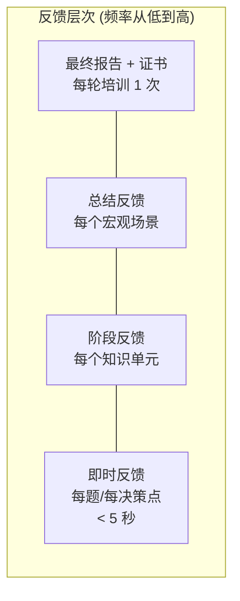

# Component: Feedback Engine (反馈引擎)

> 将原始表现数据转化为学员可理解的、可操作的、激励性的反馈。

---

## 职责

1. 多层级反馈生成（即时 / 阶段 / 总结 / 证书）
2. 归因结果转自然语言
3. 可视化数据生成
4. 可操作建议生成

---

## 反馈层次

```
反馈频率



### 1. 即时反馈 (< 5 秒)

**目标**：快速确认 + 维持流程

```
格式:
  ✅ 正确 → "正确！+ [简短原理提醒]"
  ❌ 错误 → "不对。提示: [不直接给答案，给方向]"
  ⏱️  超时 → "这个决策有时间压力。在真实场景中，你需要在 [X 分钟] 内做出判断。"
```

**设计原则**：
- 错误时不直接给答案——保护「desirable difficulty」
- 不给长文本——不打断场景沉浸
- 如果处于攻坚模式 → 不给提示，只给「正确/错误」

### 2. 阶段反馈（知识单元完成后）

**目标**：总结进步 + 指出薄弱点 + 给下一步建议

```yaml
phase_feedback:
  unit: "盈亏平衡分析"
  
  summary:
    completion: "完成 7/8 道题"
    accuracy: "正确率 75%"
    time_spent: "总用时 23 分钟"
    progress: "掌握概率: 0.45 → 0.72 (+60%)"
    
  strengths:
    - "基础公式套用已掌握，3 道基础题全部正确"
    
  weaknesses:
    - "当固定成本需要从其他数据推算时（高低点法），连续 2 题出错"
    - "错误类型: calculation — 你理解了概念但中间计算步骤容易出错"
    
  recommendations:
    - "建议在进入多产品盈亏平衡前，先巩固高低点法的数据提取技巧"
    - "预估需要: 2-3 道专项练习"
    
  next_action:
    type: "micro_scenario"
    id: "micro_break_even_calc"
    focus: "高低点法参数提取"
```

### 3. 总结反馈（宏观场景完成后）

**目标**：多维度雷达图 + 进步轨迹 + 场景复盘

```yaml
summary_feedback:
  scenario: "新产品全球发布会"
  
  overall:
    grade: "B+"
    total_decisions: 12
    correct_first_try: 8
    correct_after_hint: 3
    incorrect: 1
    
  dimension_scores:
    market_analysis: 0.82
    financial_calculation: 0.68      # ← 薄弱
    strategic_thinking: 0.75
    cross_functional_communication: 0.90
    
  trajectory:
    description: "场景前半段表现稳定。第 3 个决策（盈亏平衡计算）触发微观场景跳转。
                  经过专项练习后返回，后续财务相关决策正确率从 50% 提升到 85%。"
    
  compared_to_peers:
    percentile: 62
    description: "你的表现在同龄学员中处于前 38%。财务计算是大多数人的薄弱点。"
    
  key_takeaways:
    - "盈亏平衡分析是你从「知道公式」升级到「会灵活运用」的关键突破点"
    - "你在跨部门沟通决策中展现了较好的直觉"
```

### 4. 结业证书 + 最终报告

**目标**：综合评估 + 可展示的证书 + 薄弱模块「重新挑战」入口

```yaml
final_report:
  learner: "学员 ID 123"
  goal: "初级产品经理"
  completion_date: "2025-03-15"
  total_hours: 45
  
  overall_assessment:
    level: "达标"
    summary: "已掌握初级产品经理所需核心能力的 85%。建议在正式入职前强化财务建模。"
    
  certification:
    eligible: true
    certificate_id: "CERT-2025-00123"
    
  module_breakdown:
    - module: "市场分析"
      mastery: 0.88
      status: "优秀"
    - module: "财务建模"
      mastery: 0.65
      status: "需加强"             # ← "重新挑战薄弱模块" 入口
      retry_link: "/retry/financial_modeling"
    - module: "产品策略"
      mastery: 0.82
      status: "良好"
      
  recommended_next:
    - "重新挑战: 财务建模（盈亏平衡 + 现金流预测）"
    - "进阶课程: 中级产品经理 — 多产品线策略"
```

---

## 自然语言生成 (NLG) 策略

反馈不是模板填空，而是根据 `DiagnosisReport` 动态生成自然语言。但为了避免不稳定的生成式输出，采用**模板 + 参数化 + 规则选择**的混合方案：

```python
class FeedbackGenerator:
    
    def generate_instant(self, result, pacing_mode):
        """即时反馈"""
        
        if result.correct:
            templates = [
                "正确！{concept_reminder}",
                "对了。记住: {concept_reminder}",
            ]
            return choice(templates).format(
                concept_reminder=self._get_reminder(result.knowledge_tested[0])
            )
        else:
            if pacing_mode == "assault":
                return "不对。再试一次。"  # 攻坚模式：不提示
            else:
                return f"方向不太对。提示: {self._get_hint(result)}"
    
    def generate_phase_feedback(self, diagnosis_report):
        """阶段反馈 — 组合模板"""
        
        sections = []
        
        # 1. Progress summary
        sections.append(self._progress_summary(diagnosis_report))
        
        # 2. Strengths
        strengths = self._identify_strengths(diagnosis_report)
        if strengths:
            sections.append(f"✅ 你做得好的: {', '.join(strengths)}")
        
        # 3. Weaknesses with attribution
        for gap in diagnosis_report.knowledge_gaps:
            attribution_text = {
                "concept": "你对这个概念还不熟悉",
                "calculation": "你理解概念但在计算过程中容易出错",
                "comprehension": "你有时没完全理解题目在问什么",
                "prerequisite": f"你的前置知识 [{gap.prerequisite_gap}] 可能还没掌握牢固"
            }
            sections.append(
                f"⚠️  {gap.node_id}: {attribution_text[gap.attribution]}"
            )
        
        # 4. Recommendation
        sections.append(self._generate_recommendation(diagnosis_report))
        
        return "\n\n".join(sections)
```

---

## 可视化数据生成

反馈引擎不渲染 UI，但生成可视化的数据规格：

```yaml
# 雷达图数据
radar_chart:
  axes: ["市场分析", "财务计算", "策略思维", "跨部门沟通", "数据验证"]
  learner_scores: [0.82, 0.68, 0.75, 0.90, 0.70]
  benchmark_scores: [0.75, 0.60, 0.72, 0.80, 0.68]  # 同龄均值

# 进度轨迹
progress_timeline:
  x_axis: "时间"  # ["Week 1", "Week 2", ...]
  y_axis: "平均掌握概率"
  series:
    - name: "核心知识"
      data: [0.15, 0.32, 0.55, 0.72, 0.85]
    - name: "外围知识"
      data: [0.20, 0.45, 0.68, 0.82, 0.90]

# 知识热力图
knowledge_heatmap:
  rows: ["数据结构", "算法", "系统设计", "工程实践", "工具"]
  cols: ["L1 实用", "L2 原理", "L3 元原理"]
  data: [
    [0.9, 0.7, 0.2],   # 数据结构：会用，懂原理，元原理浅
    [0.8, 0.6, 0.1],
    [0.5, 0.5, 0.3],
    [0.7, 0.4, 0.1],   # 工程实践：能做，但原理层面偏弱
    [0.9, 0.3, 0.0]    # 工具：会用但不懂原理 → 3 年后会过时
  ]
```

---

## 反馈的设计原则

| 原则 | 说明 |
|------|------|
| **即时性** | 单题反馈 < 5 秒，阶段反馈 < 1 分钟（自动生成） |
| **归因性** | 不只说「你错了」，说「你为什么错」 |
| **可操作性** | 每个反馈必须带一个明确的下一步 |
| **成长导向** | 反馈框架是「你之前不会 X，现在会了 Y，接下来需要攻克 Z」 |
| **避免羞辱** | 错误是学习事件，不是失败。语言不暗示「你不行」 |
| **控制量** | 一次不超过 3 条关键信息。更多细节放在「展开查看」里 |
