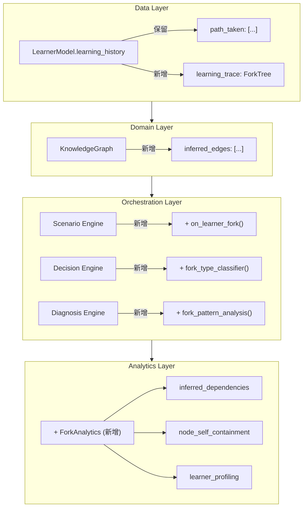

# Design: Forked Learning Trace (分叉学习追踪)

> 学习是分叉过程。学员学 A 时遇到未知概念 B → 分叉学 B → 回到 A。
> 这个文档定义：为什么要追踪分叉、怎么建模、以及在架构中放在哪里。

---

## 1. 为什么扁平路径不够

### 当前的 path_taken（扁平列表）

```yaml
path_taken: ["K_break_even", "K_fixed_cost", "K_sunk_cost", "K_fixed_cost", "K_break_even"]
```

**丢失的信息**：
- 哪些跳转是系统强制（缺口触发），哪些是学员主动探索？
- 分叉的嵌套层级（学 fixed_cost 时又分叉去 sunk_cost）
- 分叉的原因（「这个概念不会」vs「这个东西有意思我想了解」）
- 学员在分叉时花了多少时间、是否成功消化、回到主线后表现是否改善

### 升级为 Fork Tree

```yaml
learning_trace:
  root:
    node_id: "K_break_even"
    entry_reason: "scenario_required"       # 为什么进入这个节点
    duration_sec: 1200
    forks:
      - node_id: "K_fixed_cost"
        entry_reason: "learner_explore"     # 学员主动分叉
        trigger_concept: "固定成本"          # 触发分叉的具体概念
        parent_context: "BEP 公式中的 FC 参数"
        duration_sec: 600
        outcome: "mastered"                 # mastered | partial | abandoned
        return_to_parent: true
        forks:                              # 嵌套分叉！
          - node_id: "K_sunk_cost"
            entry_reason: "learner_explore"
            trigger_concept: "沉没成本 ≠ 固定成本"
            parent_context: "区分固定成本和沉没成本时产生的疑问"
            duration_sec: 300
            outcome: "partial"
            return_to_parent: true
            forks: []
```

这才是对学习过程的忠实记录。

---

## 2. 分叉的类型学

不是所有分叉都一样。系统需要区分：

| 分叉类型 | 触发者 | 含义 | 系统响应 |
|----------|--------|------|----------|
| **system_intervention** | 系统 | 诊断到缺口，强制跳转微观场景 | 现有 macro→micro 锁定机制 |
| **system_suggestion** | 系统 | 检测到可能的知识缺口，提示学员「要不要看一下 X？」 | 软提示，学员可选择忽略 |
| **learner_explore** | 学员 | 学员主动点击/搜索某个未知概念 | 记录但不打断。如果分叉后主线表现改善 → 这个分叉可能是一个隐性依赖，补入知识图谱 |
| **learner_stuck** | 学员 | 学员在当前节点多次失败后自己跳出去找资源 | 信号：系统没检测到但学员感受到的缺口。优先分析 |
| **learner_curious** | 学员 | 纯好奇心驱动，分叉到不直接相关但有意思的内容 | 正面信号：高动机。不干预 |

**区分方式**：
- 系统触发的分叉 → Decision Engine 记录 `action: jump_to_micro`
- 学员触发的分叉 → Scenario Engine 在学员点击链接/搜索/跳转时记录 `action: fork_to_explore`，然后根据后续行为推断子类型

---

## 3. 分叉追踪的数据价值

### 3.1 发现隐性依赖

```
多个学员在学习 K_break_even 时，都自主分叉去学了 K_cost_classification
但知识图谱中 K_cost_classification 不是 K_break_even 的 prerequisites

→ 系统检测到分叉频率 > 阈值（如 40% 学员都分叉了）
→ 自动建议：在 K_break_even 的 prerequisites 中添加 K_cost_classification
→ 或至少标注为 strong_related
```

这就是**从实际学习行为中反向优化知识图谱**。

### 3.2 评估知识节点的「自包含度」

```
节点 A: 80% 学员学它时分叉了 → 自包含度低，内容需要重构
节点 B: 5% 学员分叉 → 自包含度高，内容设计好
```

这是一个内容质量的自动评估指标。

### 3.3 区分学习者画像

| 画像 | 分叉模式 | 策略 |
|------|----------|------|
| **依赖型** | 大量 system_intervention 分叉，很少主动分叉 | 需要更多前置知识铺垫 |
| **探索型** | 大量 learner_curious 分叉，分叉路径宽广 | 可以提供更多「连接提示」，加速 L3 元原理形成 |
| **效率型** | 分叉少但精准，每次分叉后主线表现改善 | 路径值得推荐给其他学员 |
| **迷失型** | 分叉多且深，且很少 return_to_parent | 需要干预——拉回主线 |

---

## 4. 在架构中的位置

分叉追踪**不是新组件**，而是对现有组件的升级：



**核心原则**：学习追踪数据结构升级在 Data Layer，分析逻辑在 Orchestration/Diagnosis，聚合洞察在 Analytics。改动是增量式的，不影响现有接口。

---

## 5. 数据结构定义

### ForkNode

```yaml
ForkNode:
  id: string                          # 唯一标识
  node_id: string                     # 对应的知识节点
  parent_fork_id: string | null       # 父分叉 ID（null = 根节点）
  
  # 进入信息
  entry_reason: 
    "scenario_required"              # 场景必需（主线）
    | "system_intervention"          # 系统强制跳转
    | "system_suggestion"            # 系统建议，学员接受
    | "learner_explore"             # 学员主动探索
    | "learner_stuck"               # 学员卡住后自行跳转
    | "learner_curious"             # 纯好奇心
    
  trigger_concept: string | null     # 触发分叉的具体概念/术语
  parent_context: string | null      # 在父节点的什么上下文下触发分叉
  
  # 时间信息
  started_at: datetime
  ended_at: datetime | null
  duration_sec: int
  
  # 结果
  outcome: 
    "mastered"                       # 学完且 p_mastery 提升
    | "partial"                      # 学了一部分，未完全掌握
    | "abandoned"                    # 放弃，回到父节点
    | "in_progress"                  # 仍在进行中
    
  return_to_parent: boolean          # 是否回到了父节点
  parent_performance_delta: float    # 回到父节点后，该节点掌握度的变化
  
  # 嵌套
  forks: [ForkNode]                  # 子分叉
```

### ForkTrace（完整追踪记录）

```yaml
ForkTrace:
  learner_id: string
  session_id: string
  root: ForkNode                     # 根节点 = 主线场景/知识单元
  total_duration_sec: int
  total_nodes_visited: int
  max_depth: int                     # 最深嵌套层数
  
  summary:
    total_forks: int
    by_reason:
      system_intervention: 3
      learner_explore: 5
      learner_curious: 2
    avg_depth: float
    return_rate: float               # 多少分叉最终回到了父节点
```

---

## 6. 关键操作

### 6.1 记录学员主动分叉

```python
def record_learner_fork(learner_id, from_node_id, to_node_id, trigger_concept, context):
    """
    当学员在当前节点点击了一个未知概念，跳转到另一个知识节点时调用
    """
    trace = get_active_trace(learner_id)
    current_node = trace.find_current_node()
    
    fork = ForkNode(
        id=generate_id(),
        node_id=to_node_id,
        parent_fork_id=current_node.id,
        entry_reason="learner_explore",   # 初始标记，后续可能重新分类
        trigger_concept=trigger_concept,
        parent_context=context,
        started_at=now(),
        outcome="in_progress",
        return_to_parent=False,
        forks=[]
    )
    
    current_node.forks.append(fork)
    save_trace(trace)
```

### 6.2 学员返回父节点时

```python
def record_return_from_fork(learner_id, fork_id, outcome, parent_perf_before, parent_perf_after):
    """
    学员结束分叉，回到父节点
    """
    trace = get_active_trace(learner_id)
    fork = trace.find_node(fork_id)
    
    fork.ended_at = now()
    fork.duration_sec = (fork.ended_at - fork.started_at).seconds
    fork.outcome = outcome
    fork.return_to_parent = True
    fork.parent_performance_delta = parent_perf_after - parent_perf_before
    
    # 重新分类分叉类型
    fork.entry_reason = reclassify_fork_type(fork)
    
    save_trace(trace)
```

### 6.3 分叉类型重新分类

```python
def reclassify_fork_type(fork):
    """
    根据分叉的后续行为，修正初始的类型标记
    """
    # 初始标记是 learner_explore，但可以进一步细分
    
    if fork.outcome == "abandoned" and fork.duration_sec < 60:
        return "learner_curious"           # 快速浏览 = 好奇
    
    if fork.duration_sec > 300 and fork.outcome in ["mastered", "partial"]:
        # 花了很长时间学的 → 可能是有实际缺口
        if fork.parent_performance_delta > 0.1:
            return "learner_stuck"         # 学完后主线表现改善 = 之前卡住了
        else:
            return "learner_explore"       # 学完但主线没改善 = 探索
    
    return fork.entry_reason  # 保持原样
```

---

## 7. 聚合分析：从分叉数据到知识图谱优化

### 7.1 发现隐性依赖

```python
def infer_missing_prerequisites(min_fork_ratio=0.4, min_perf_delta=0.1):
    """
    分析所有学员的分叉数据，发现知识图谱中缺失的依赖边
    """
    candidates = []
    
    for node_A in knowledge_graph.nodes:
        for node_B in knowledge_graph.nodes:
            if node_A == node_B:
                continue
            if node_B in knowledge_graph.get_prerequisites(node_A):
                continue  # 已经是显式依赖
            
            # 统计：多少学员在学 A 时自主分叉去了 B？
            forks_A_to_B = query_forks(
                parent_node=node_A, 
                forked_node=node_B,
                reason_in=["learner_explore", "learner_stuck"]
            )
            
            total_learners_A = query_total_learners(node_A)
            fork_ratio = forks_A_to_B / max(total_learners_A, 1)
            
            # 分叉后回到 A 的表现改善
            avg_perf_delta = avg(fork.parent_performance_delta for fork in forks_A_to_B)
            
            if fork_ratio >= min_fork_ratio and avg_perf_delta >= min_perf_delta:
                candidates.append(InferredEdge(
                    from_node=node_B,
                    to_node=node_A,        # B 是 A 的前置
                    type="inferred_prerequisite",
                    confidence=fork_ratio * avg_perf_delta,
                    evidence_count=forks_A_to_B
                ))
    
    return sorted(candidates, key=lambda e: e.confidence, reverse=True)
```

### 7.2 计算节点自包含度

```python
def compute_self_containment(node_id):
    """
    0 = 每个学员学它都分叉
    1 = 没人分叉（自包含）
    """
    total_learners = query_total_learners(node_id)
    learners_with_forks = query_learners_with_any_fork(node_id)
    
    if total_learners == 0:
        return 1.0
    
    return 1 - (learners_with_forks / total_learners)
```

---

## 8. 与现有流程的整合

### 学员在宏观场景中主动分叉的流程

```
[宏观场景: 新产品发布会]
  │
  ├── 决策点 3: 计算盈亏平衡点
  │     │
  │     ├── 学员看到 "固定成本" 这个概念，不确定它包含什么
  │     ├── 点击 "固定成本" → 触发 learner_fork 事件
  │     │
  │     ├── Scenario Engine: record_learner_fork()
  │     │   保存当前场景的 checkpoint
  │     │   但不同于 system_intervention：不锁定场景
  │     │   显示一个侧边面板/弹出窗口，而非完全跳转
  │     │
  │     ├── 学员在侧边面板中学了固定成本 vs 可变成本
  │     │   然后又分叉到 "沉没成本"（嵌套 fork）
  │     ├── 关闭侧边面板，回到决策点
  │     │
  │     ├── Scenario Engine: record_return_from_fork()
  │     │   对比分叉前后的表现
  │     │
  │     └── 继续宏观场景
```

**关键设计：学员主动分叉不应该锁定宏观场景。** 区别在于：

| | 系统触发的跳转 | 学员主动分叉 |
|---|---|---|
| 宏观场景 | **锁定**（保存 checkpoint） | **不锁定**（侧边面板） |
| 目的 | 强制攻坚，缺口必须补 | 辅助理解，学员自己决定深度 |
| 返回条件 | p_mastery 达标 | 学员随时可关闭 |
| 追踪 | 记录为 system_intervention | 记录为 learner_explore |
| 后续行为 | 解锁宏观 | 对比分叉前后表现 |

---

## 9. 要不要追踪？最终回答

**要。而且追踪的价值不仅在于记录，而在于让系统「看见」三件事：**

1. **学员的真实心理路径**，不是系统预设的最优路径——这比任何显式测试更能反映学员的知识结构
2. **知识的隐性边界**——哪些概念实际上纠缠在一起，即使专家定义的知识图谱说它们是独立的
3. **内容质量的反馈**——如果某个知识节点引发大量逃避型分叉（learner_stuck），说明它的教学内容设计有问题

**不应该做的**：强制学员按线性路径走，惩罚或阻止分叉。分叉是学习，不是偏离。

**应该做的**：追踪一切分叉，但在 UI 层面**根据 pacing_mode 控制提示强度**：
- 巡航模式：分叉自由，系统偶尔提示「你分叉了 3 层深，主线还在等你」
- 攻坚模式：限制分叉深度（最多 1 层），超过则提示先完成当前攻坚

---

## 10. 总结：改动范围

```
需要改动的文件:
  training-system/components/learner-model.md    # 新增 ForkNode、ForkTrace 数据结构
  training-system/components/scenario-engine.md  # 新增 on_learner_fork() 流程
  training-system/components/diagnosis-engine.md # 新增分叉模式分析信号
  training-system/architecture.md                # 架构图中标注 Fork Trace 位置

不需要改动:
  training-system/training_rules.md   # 2.3 知识交织性已经覆盖了这个概念
  training-system/input-spec.md       # 分叉追踪是运行时行为，不是输入
```

改动是**增量式的**——在现有数据结构上增加 `learning_trace: ForkTree` 字段，同时保留 `path_taken: [...]` 做向下兼容。所有现有接口不受影响。
