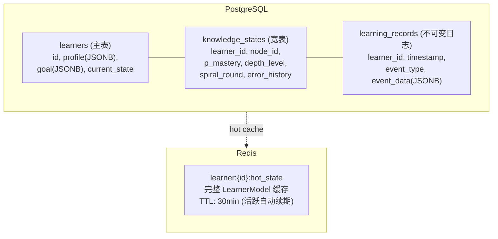

# Component: Learner Model (学员模型)

> 系统对学员的完整内部表征。是所有其他组件共享的数据中枢。

---

## 职责

1. 存储学员画像（背景、目标、偏好）
2. 维护每个知识节点的掌握状态
3. 记录完整学习历史
4. 追踪动机与行为指标
5. 支持快照/回滚（用于检查点恢复）

---

## 数据模型

### 整体结构

```yaml
LearnerModel:
  # ── 基础画像 ──
  profile:
    id: string
    name: string
    email: string
    created_at: datetime
    
    background:
      education: string           # "cs_bachelor" | "bootcamp" | "self_taught" | ...
      years_of_experience: float
      known_languages: [string]   # ["python", "javascript"]
      known_frameworks: [string]
      prior_roles: [string]
      
    learning_preferences:
      preferred_pace: "steady" | "aggressive" | "relaxed"
      preferred_mode: "visual" | "textual" | "interactive"
      daily_time_budget_min: int
      preferred_session_time: "morning" | "afternoon" | "evening"
      
  # ── 目标配置 ──
  goal:
    type: "job_ready" | "skill_upgrade" | "interview_prep" | "custom"
    target_role: string           # "junior_software_engineer"
    target_industry: string | null
    target_companies: [string] | null
    deadline: datetime | null
    custom_requirements: [string] | null
    
    active_knowledge_nodes: [string]  # 需要掌握的知识节点 ID 列表
    active_plugin_id: string          # 正在使用的 Training Plugin
    
  # ── 知识状态（核心） ──
  knowledge_state: Map<NodeID, KnowledgeNodeState>
  
  # ── 学习历史 ──
  learning_history: LearningHistory
  
  # ── 动机指标 ──
  motivation_metrics: MotivationMetrics
  
  # ── 当前状态 ──
  current_state: CurrentState
```

### KnowledgeNodeState

```yaml
KnowledgeNodeState:
  node_id: string
  
  # BKT 参数
  p_mastery: float              # 当前掌握概率 (0-1)
  p_initial: float              # 初始掌握概率
  p_learn: float                # 学习率
  p_guess: float                # 猜测率
  p_slip: float                 # 失误率
  
  # 深度追踪
  depth_level: 1 | 2 | 3       # 当前到达的理解层次
  spiral_round: int             # 螺旋轮次 (第几轮在学这个知识)
  
  # 统计
  practice_count: int           # 总练习次数
  correct_count: int            # 正确次数
  last_practiced: datetime      # 上次练习时间
  first_encountered: datetime   # 首次接触时间
  total_time_spent_sec: int     # 总投入时间
  
  # 错误历史（最近 N 条，用于模式分析）
  error_history:
    - timestamp: datetime
      exercise_id: string
      error_type: concept | calculation | comprehension | prerequisite
      time_spent_sec: int
  
  # 来源追踪
  learned_from:
    - source_type: "theory_material" | "exercise" | "scenario" | "micro_scenario"
      source_id: string
      timestamp: datetime
      effectiveness: float      # 该来源对掌握度的贡献
```

### LearningHistory

```yaml
LearningHistory:
  completed_scenarios:
    - scenario_id: string
      type: macro | micro | quiz | sandbox
      started_at: datetime
      completed_at: datetime
      performance:
        total_decisions: int
        correct_first_try: int
        final_score: float
      knowledge_gained: [NodeID]  # 在该场景中获得提升的知识节点
        
  path_taken: [NodeID]           # 实际学习顺序（时间线）
  
  sessions:
    - date: date
      duration_sec: int
      scenarios_completed: [string]
      exercises_completed: int
      mode_distribution:          # 各模式占比
        cruise: float
        assault: float
        recover: float
        
  total_stats:
    total_time_sec: int
    total_exercises: int
    total_scenarios: int
    streaks:
      current_daily_streak: int
      longest_daily_streak: int
```

### MotivationMetrics

```yaml
MotivationMetrics:
  sessions_per_week: float         # 过去 4 周平均
  avg_session_duration_sec: int
  session_frequency_trend: "stable" | "increasing" | "decreasing"
  
  hesitation:
    avg_hesitation_sec: float      # 从看到题到开始作答的平均时间
    baseline_hesitation_sec: float
    trend: "decreasing" | "stable" | "increasing"  # 增加 = 焦虑增加
  
  engagement:
    voluntary_explorations: int    # 主动探索（非必须路径的跳转）
    hint_usage_rate: float         # 提示使用率（低 = 自信/挣扎）
    skip_rate: float               # 跳过率（高 = 挫败/无聊）
    
  dropout_risk: float              # 0-1，综合评估
  motivation_index: float          # 0-1，综合指标
  
  intervention_history:
    - type: "difficulty_reduction" | "encouragement_message" | "pacing_change"
      timestamp: datetime
      reason: string
      effect: "positive" | "neutral" | "negative"
```

### CurrentState

```yaml
CurrentState:
  active_scenario: string | null
  active_phase: string | null
  active_decision_point: string | null
  pacing_mode: "cruise" | "assault" | "recover"
  checkpoint: Checkpoint | null    # 如果宏观场景被锁定
```

---

## 关键操作

### 1. 更新知识状态

```python
def update_knowledge_state(learner_id, performance_record):
    learner = LearnerStore.get(learner_id)
    
    for node_id, result in performance_record.node_results.items():
        state = learner.knowledge_state[node_id]
        
        # BKT 更新
        state.p_mastery = bkt_model.update(state.p_mastery, result.correct)
        
        # 更新统计
        state.practice_count += 1
        if result.correct:
            state.correct_count += 1
        state.last_practiced = now()
        state.total_time_spent_sec += result.time_spent_sec
        
        # 记录错误
        if not result.correct:
            state.error_history.append({
                "timestamp": now(),
                "exercise_id": performance_record.exercise_id,
                "error_type": classify_error(result, learner),
                "time_spent_sec": result.time_spent_sec
            })
            # 只保留最近 10 条
            state.error_history = state.error_history[-10:]
        
        # 检查螺旋升级
        if (state.p_mastery > 0.85 
            and state.depth_level < 3
            and state.spiral_round >= 1):
            state.depth_level += 1
            state.spiral_round += 1
            # 重置 p_mastery（在新深度上从较低值开始）
            state.p_mastery = 0.30  # 进入更深层次，初始掌握降低
    
    LearnerStore.save(learner)
```

### 2. 应用知识衰减

```python
def apply_decay(learner_id):
    """每周运行一次，对超过 7 天未练习的知识节点应用衰减"""
    learner = LearnerStore.get(learner_id)
    
    for node_id, state in learner.knowledge_state.items():
        days_since_practice = (now() - state.last_practiced).days
        
        if days_since_practice > 7:
            weeks = days_since_practice / 7
            state.p_mastery *= (1 - 0.05) ** weeks  # 每周衰减 5%
            state.p_mastery = max(0.05, state.p_mastery)  # 保底 0.05
    
    LearnerStore.save(learner)
```

### 3. 创建检查点

```python
def create_checkpoint(learner_id, scenario_id, phase_id, dp_id):
    learner = LearnerStore.get(learner_id)
    
    checkpoint = Checkpoint(
        scenario_id=scenario_id,
        phase_id=phase_id,
        decision_point_id=dp_id,
        knowledge_state_snapshot=deepcopy(learner.knowledge_state),
        context_variables=deepcopy(learner.current_state.context_vars),
        timestamp=now()
    )
    
    learner.current_state.checkpoint = checkpoint
    LearnerStore.save(learner)
```

### 4. 从检查点恢复

```python
def restore_checkpoint(learner_id):
    learner = LearnerStore.get(learner_id)
    cp = learner.current_state.checkpoint
    
    # 比较恢复前后的知识状态 → 展示进步
    before = cp.knowledge_state_snapshot
    after = learner.knowledge_state
    improvements = []
    for node_id in before:
        delta = after[node_id].p_mastery - before[node_id].p_mastery
        if delta > 0.05:
            improvements.append({
                "node_id": node_id,
                "before": before[node_id].p_mastery,
                "after": after[node_id].p_mastery,
                "delta": delta
            })
    
    # 恢复上下文 → 继续宏观场景
    learner.current_state.checkpoint = None
    
    return RestoreResult(
        scenario_id=cp.scenario_id,
        phase_id=cp.phase_id,
        decision_point_id=cp.decision_point_id,
        improvements=improvements
    )
```

---

## 存储设计


