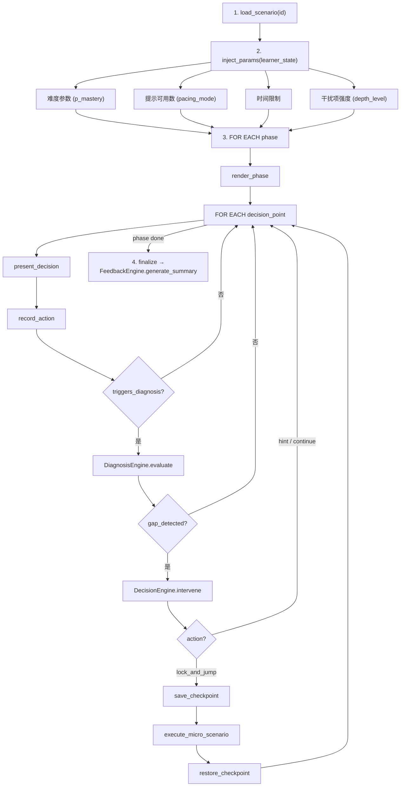

# Component: Scenario Engine (场景引擎)

> 负责场景的加载、参数化、呈现、交互记录。场景是学习发生的场所，不是验证工具。

---

## 职责

1. 加载场景定义（宏观/微观/测验/沙盒）
2. 根据学员状态注入参数（难度、提示数、时间限制）
3. 驱动场景的逐步呈现
4. 在决策点收集 PerformanceRecord
5. 与 Diagnosis Engine 协作——触发诊断、接收锁定/解锁指令

---

## 场景类型

### 1. 宏观场景 (Macro Scenario)

模拟真实工作流程，保持沉浸感。学员在场景中扮演角色，做出一系列决策。

```yaml
macro_scenario:
  id: "macro_new_product_launch"
  name: "新产品全球发布会"
  role: "产品负责人"
  estimated_duration_min: 45
  
  # 场景中的知识节点（全局）
  knowledge_coverage:
    - "K_market_analysis"
    - "K_pricing_strategy"
    - "K_break_even"
    - "K_financial_modeling"
    - "K_cross_team_communication"
  
  phases:
    - id: "phase_1_briefing"
      name: "接受任务"
      duration_sec: 300
      description: |
        CEO 通知你: 公司新产品将在 3 个月后全球发布。
        你需要制定上市策略并提交执行计划。
        市场部、财务部、研发部将向你提供数据支持。
      
      # 该阶段的知识主要是信息获取，不考试
      triggers_diagnosis: false
      
    - id: "phase_2_market_analysis"
      name: "市场分析"
      duration_sec: 600
      description: |
        你需要评估目标市场规模、竞品定价、以及我们的成本结构。
        市场部提供了 3 份报告（其中 1 份数据有误——考察数据验证能力）。
      
      decision_points:
        - id: "decision_cost_structure"
          name: "评估成本结构"
          description: "根据财务部数据，固定成本 $500K，可变成本 $30/unit。你需要..."
          knowledge_tested: ["K_cost_structure", "K_fixed_vs_variable"]
          
        - id: "decision_market_size"
          name: "估算市场规模"
          knowledge_tested: ["K_market_sizing"]
          
    - id: "phase_3_pricing"
      name: "定价决策"
      duration_sec: 900
      description: |
        这是场景的核心。市场部建议低价策略抢占份额,
        财务部警告低于 $50 会亏损。你需要做盈亏平衡分析。
      
      decision_points:
        - id: "decision_break_even_calc"
          name: "计算盈亏平衡点"
          description: "基于成本数据和可能的定价方案，计算盈亏平衡点"
          knowledge_tested: ["K_break_even", "K_contribution_margin"]
          triggers_diagnosis: true           # ← 关键决策点
          acceptable_correctness: 0.70
          on_gap_detected:
            severity_threshold: "critical"   # 低于此 → 锁定场景
            micro_scenario: "micro_break_even_calc"
            unlock_condition: "p_mastery > 0.70"
          
        - id: "decision_final_price"
          name: "选定最终价格"
          knowledge_tested: ["K_pricing_strategy", "K_competitive_analysis"]
          
    - id: "phase_4_execution"
      name: "执行与复盘"
      description: "最终成果评估 + 多维度反馈"
      triggers_diagnosis: false

  # 关联的微观场景
  micro_scenarios:
    K_break_even: "micro_break_even_calc"
    K_contribution_margin: "micro_contribution_margin"
    K_pricing_strategy: "micro_pricing_models"
```

### 2. 微观场景 (Micro Scenario)

针对特定知识节点的深度攻坚。比宏观场景更聚焦，反馈更密集。

```yaml
micro_scenario:
  id: "micro_break_even_calc"
  name: "精确计算盈亏平衡点"
  parent_macro: "macro_new_product_launch"
  target_knowledge: "K_break_even"
  estimated_duration_min: 15
  
  description: |
    盈亏平衡点是产品决策的核心。你需要精确掌握它的计算、
    参数含义、以及在不同约束下的变化。
  
  steps:
    - id: "step_1_recall"
      name: "回顾概念"
      type: "instruction"
      content_ref: "L1_break_even_formula"
      
    - id: "step_2_basic_calc"
      name: "基础计算"
      type: "exercise"
      difficulty_params:
        fixed_cost_known: true
        variable_cost_known: true
        price_known: true
        # 标准参数，直接套公式
      acceptable_correctness: 0.80
      
    - id: "step_3_missing_params"
      name: "参数推断"
      type: "exercise"
      difficulty_params:
        fixed_cost_known: false      # 需要从其他数据推算
        given_data: "总成本 $800K（产量 10K units 时），产量 8K units 时总成本 $680K"
        # 需要先算可变成本（高低点法），再算固定成本，再算 BEP
      acceptable_correctness: 0.70
      
    - id: "step_4_multi_product"
      name: "多产品场景"
      type: "exercise"
      difficulty_params:
        product_count: 3
        shared_fixed_cost: true      # 需要分摊固定成本
      acceptable_correctness: 0.60   # 攻坚允许较低的正确率
        
    - id: "step_5_synthesis"
      name: "回到原场景"
      type: "transition"
      action: "unlock_macro"
      carry_over_params:             # 将学员在微观场景中得出的答案带回宏观
        - "calculated_bep"
        - "recommended_price"
```

### 3. 测验单元 (Quiz)

知识学习模块的结构化评估。

```yaml
quiz_unit:
  id: "quiz_data_structures_01"
  name: "数据结构 - 单元测验"
  knowledge_covered: ["K_array", "K_linked_list", "K_hash_map"]
  
  passing_threshold: 0.75
  
  questions:
    - id: "q_001"
      type: "multiple_choice"
      knowledge_tested: ["K_array"]
      difficulty: 1
      content_ref: "q_001_content"
      
    - id: "q_002"
      type: "code_output_prediction"
      knowledge_tested: ["K_array", "K_memory_model"]  # 一题多知识点
      difficulty: 2
      content_ref: "q_002_content"
      
  # Q-Matrix 片段
  q_matrix:
    q_001: { K_array: 1.0 }
    q_002: { K_array: 0.6, K_memory_model: 0.4 }
```

### 4. 沙盒 (Sandbox)

自由探索环境，无固定路径。适合练习调试、代码阅读等。

```yaml
sandbox:
  id: "sandbox_debugging_practice"
  name: "Bug 狩猎场"
  
  # 注入的故障
  injected_bugs:
    - bug_id: "bug_off_by_one"
      location: "src/sort.py:23"
      symptoms: "数组最后一位未被排序"
      knowledge_required: ["K_array_indexing", "K_loop_boundary"]
      
    - bug_id: "bug_race_condition"
      location: "src/counter.py:15"
      symptoms: "高并发下计数不准确"
      knowledge_required: ["K_concurrency", "K_thread_safety"]
```

---

## 场景执行流程



---

## 场景参数注入策略

```python
def inject_params(scenario_def, learner_state):
    """
    根据学员状态调整场景参数
    """
    
    mode = learner_state.pacing_mode  # cruise | assault | recover
    
    # 基础参数映射
    param_map = {
        "cruise": {
            "time_limit_multiplier": 1.5,     # 宽松
            "hints_available": 2,
            "distractor_strength": "low",      # 干扰项弱
            "feedback_timing": "instant",
            "new_old_ratio": 0.20
        },
        "assault": {
            "time_limit_multiplier": 1.0,
            "hints_available": 1,
            "distractor_strength": "high",     # 干扰项强
            "feedback_timing": "after_attempt",
            "new_old_ratio": 0.40
        },
        "recover": {
            "time_limit_multiplier": 2.0,
            "hints_available": 3,
            "distractor_strength": "low",
            "feedback_timing": "instant",
            "new_old_ratio": 0.10
        }
    }
    
    # 基于知识掌握度的难度调整
    for decision_point in scenario_def.decision_points:
        avg_mastery = mean([
            learner_state.knowledge_state[k].p_mastery 
            for k in decision_point.knowledge_tested
        ])
        # 掌握度越低 → 降低难度（但不能降太多，保底 0.5）
        decision_point.difficulty_multiplier = max(0.5, avg_mastery + 0.2)
    
    return scenario_def
```

---

## 检查点 (Checkpoint) 机制

宏观场景被锁定时需要保存检查点，以便从微观场景返回后无缝恢复。

```
Checkpoint {
  scenario_id: string
  phase_id: string
  decision_point_id: string        # 在哪个决策点暂停
  learner_state_snapshot: object   # 锁定时的学员状态快照
  context_variables: object        # 场景上下文（已收集的数据、已做的决策等）
  timestamp: datetime
}

# 恢复时：
#   1. 加载 checkpoint
#   2. 比较当前 KnowledgeState 和快照 → 展示进步
#   3. 携带微观场景的输出变量（如 calculated_bep）
#   4. 从暂停的决策点继续
```
