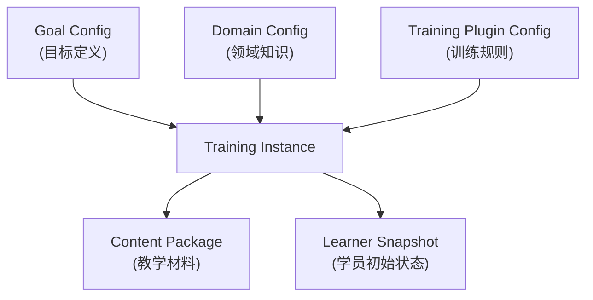

# Input Specification — 训练系统的输入定义

> 定义如何向训练系统输入：学习材料、目标、训练场景、插件配置。
> 解决「在一个真实训练场景中，我应该如何定义输入」的问题。

---

## 目录

1. [输入总览](#1-输入总览)
2. [Goal Config（目标配置）](#2-goal-config)
3. [Domain Config（领域配置）](#3-domain-config)
4. [Content Package（内容包）](#4-content-package)
5. [Training Plugin（训练插件）](#5-training-plugin)
6. [Learner Snapshot（学员快照）](#6-learner-snapshot)
7. [完整输入示例](#7-完整输入示例)

---

## 1. 输入总览

训练系统每次启动一个「培训实例」需要以下输入：



每个输入的定位：

| 输入 | 回答的问题 | 谁提供 | 变更频率 |
|------|-----------|--------|----------|
| **Goal Config** | 学什么、为什么要学 | 学员/管理员 | 每次培训实例 |
| **Domain Config** | 这个领域的知识长什么样 | 领域专家 | 偶尔更新 |
| **Training Plugin** | 用什么规则来教 | 教学设计师 | 偶尔更新 |
| **Content Package** | 具体的教学材料 | 内容创作者 | 经常扩充 |
| **Learner Snapshot** | 学员现在什么水平 | 系统自动维护 | 实时更新 |

---

## 2. Goal Config

定义学员的学习目标。这是系统的「北极星」——所有决策都围绕这个展开。

```yaml
# goal.yaml
id: "goal_learner_123_junior_swe"
learner_id: "learner_123"

target:
  # 方式 1: 基于标准岗位模板
  role_template: "junior_software_engineer"
  
  # 方式 2: 自定义目标
  # custom:
  #   description: "想转行做后端开发，目标公司: 字节跳动"
  #   required_skills: ["python", "go", "mysql", "redis", "system_design"]
  #   preferred_industries: ["tech"]
  
  # 方式 3: 基于 JD URL 自动解析
  # jd_urls:
  #   - "https://www.zhipin.com/job_detail/xxx.html"
  #   - "https://www.lagou.com/jobs/xxx.html"
  
  constraints:
    deadline: "2025-06-01"                    # 截止日期（可选）
    max_hours_per_week: 15                    # 每周时间预算
    priority_dimensions:                       # 优先级权重
      interview_readiness: 0.5                 # 面试准备
      practical_ability: 0.3                  # 实际工作能力
      foundational_understanding: 0.2         # 基础理解

  # 从目标自动推导出的知识节点（可由系统自动生成，也可手动指定）
  # 如果使用 role_template，系统会根据 Domain Config 自动填充
  target_knowledge_nodes:
    - "K_python_basics"
    - "K_data_structures"
    - "K_algorithms_easy"
    - "K_sql"
    - "K_git"
    - "K_web_basics"
    - "K_system_design_basics"
    # ... 由系统从 Domain Config 的 goal_templates 中自动展开
```

---

## 3. Domain Config

定义特定领域的知识结构。这是一个领域的「知识宇宙」的定义。

```yaml
# domain_software_engineering.yaml
id: "domain_software_engineering"
name: "软件工程"
version: "2.1.0"

# ── 知识节点定义 ──
# 完整的知识节点列表（所有可能的知识节点，不限于某个岗位）
knowledge_nodes:
  - id: "K_python_basics"
    name: "Python 基础"
    category: "programming_language"
    description: "变量、控制流、函数、基本数据结构"
    difficulty: 1
    estimated_hours: 20
    prerequisites: []
    
  - id: "K_python_advanced"
    name: "Python 进阶"
    category: "programming_language"
    description: "装饰器、生成器、上下文管理器、元类"
    difficulty: 3
    estimated_hours: 15
    prerequisites: ["K_python_basics"]
    
  - id: "K_data_structures"
    name: "数据结构"
    category: "cs_fundamentals"
    description: "数组、链表、栈、队列、哈希表、树、图"
    difficulty: 3
    estimated_hours: 40
    prerequisites: ["K_python_basics"]
    children:
      - "K_array_list"
      - "K_hash_map"
      - "K_tree_graph"
      - "K_stack_queue"
    
  # ... 数百个知识节点
  
# ── 知识节点之间的边 ──
edges:
  - from: "K_python_basics"
    to: "K_data_structures"
    type: "prerequisite"
    
  - from: "K_data_structures"
    to: "K_algorithms"
    type: "prerequisite"
    
  - from: "K_sql"
    to: "K_data_structures"
    type: "related"
    description: "理解索引原理需要哈希表和 B+ 树的知识"
    
  - from: "K_design_patterns"
    to: "K_solid_principles"
    type: "analogous"
    description: "设计模式是 SOLID 原则的具体实现"

# ── 目标岗位模板 ──
# 定义常见岗位 → 知识节点的映射
goal_templates:
  - role: "junior_software_engineer"
    name: "初级软件工程师"
    required_nodes:
      - node_id: "K_python_basics"
        depth_target: 2
        weight: 0.9
        is_core: true
      - node_id: "K_data_structures"
        depth_target: 2
        weight: 0.95
        is_core: true
      - node_id: "K_algorithms_easy"
        depth_target: 1           # 初级岗只需 L1
        weight: 0.8
        is_core: true
      - node_id: "K_sql"
        depth_target: 2
        weight: 0.85
        is_core: true
      - node_id: "K_git"
        depth_target: 2
        weight: 0.8
        is_core: false
      - node_id: "K_web_basics"
        depth_target: 1
        weight: 0.6
        is_core: false
      - node_id: "K_linux_basics"
        depth_target: 1
        weight: 0.5
        is_core: false
        
  - role: "senior_software_engineer"
    name: "高级软件工程师"
    required_nodes:
      - node_id: "K_python_advanced"
        depth_target: 3
        weight: 0.9
        is_core: true
      # ... 更多、更深的知识节点
      
  - role: "product_manager"
    name: "产品经理"
    required_nodes:
      - node_id: "K_market_analysis"
        depth_target: 2
        weight: 0.9
        is_core: true
      # ...
```

---

## 4. Content Package

具体的教学材料。这是系统里最「重」但最灵活的部分——内容创作者可以持续扩充而不影响系统架构。

```yaml
# content_package_swe_v1.yaml
id: "content_swe_v1"
name: "软件工程教学内容包 v1"
domain: "domain_software_engineering"
version: "1.3.0"

# ── 理论材料（按 L1/L2/L3 组织）──
theory_materials:
  - id: "mat_data_structures_L1"
    node_id: "K_data_structures"
    depth: 1
    format: "interactive_text"    # interactive_text | video | slides | sandbox
    title: "数据结构：从数组到哈希表"
    estimated_minutes: 45
    sections:
      - title: "数组"
        content_ref: "content/arrays.md"
        exercises: ["ex_array_01", "ex_array_02"]
      - title: "链表"
        content_ref: "content/linked_list.md"
        exercises: ["ex_ll_01"]
        
  - id: "mat_data_structures_L2"
    node_id: "K_data_structures"
    depth: 2
    format: "interactive_text"
    title: "数据结构原理：时间与空间的权衡"
    estimated_minutes: 60
    # ...

  - id: "mat_data_structures_L3"
    node_id: "K_data_structures"
    depth: 3
    format: "cross_domain_connection"
    title: "数据结构背后的元原理：索引、寻址、局部性"
    estimated_minutes: 30
    connections:
      - "数据库索引 → B+ 树 → 为什么磁盘用树而内存用哈希"
      - "CPU 缓存 → 数组的缓存友好性 → 计算机体系结构"
      - "Git 的 content-addressable storage → 哈希表的极致应用"

# ── 题目库 ──
exercises:
  - id: "ex_array_01"
    node_ids: ["K_array_list"]
    difficulty: 1
    type: "code_writing"
    content_ref: "exercises/array_01.md"
    solution_ref: "solutions/array_01.py"
    test_cases_ref: "tests/array_01.py"
    
  - id: "ex_hashmap_03"
    node_ids: ["K_hash_map", "K_collision_resolution"]
    difficulty: 3
    type: "multiple_choice"
    # ...

# ── 场景脚本 ──
scenarios:
  - id: "macro_new_product_launch"
    type: "macro"
    # ... (见 scenario-engine.md 的完整定义)
    
  - id: "micro_break_even_calc"
    type: "micro"
    parent_macro: "macro_new_product_launch"
    # ... (见 scenario-engine.md 的完整定义)
    
  - id: "sandbox_debugging_practice"
    type: "sandbox"
    # ...

# ── Q-Matrix ──
q_matrix:
  "ex_array_01": { "K_array_list": 1.0 }
  "ex_array_02": { "K_array_list": 0.7, "K_memory_model": 0.3 }
  "ex_hashmap_03": { "K_hash_map": 0.5, "K_collision_resolution": 0.5 }
  "decision_break_even_calc": { "K_break_even": 0.6, "K_cost_structure": 0.4 }
  # ...
```

---

## 5. Training Plugin

打包完整的训练规则集。这是系统的「教学法」配置。

```yaml
# training_plugin_swe_junior.yaml
# 引用 training_rules.md 中的所有原则，并给出具体参数

id: "training_plugin_swe_junior_v1"
name: "初级软件工程师训练插件"
rules_version: "1.0"          # 对应的 training_rules.md 版本
domain_id: "domain_software_engineering"

# ── 知识图谱配置 ──
knowledge_graph:
  source: "domain_software_engineering"   # 引用 Domain Config
  node_overrides:                          # 可覆盖 Domain Config 中的参数
    "K_data_structures":
      depth_target: 2
      is_core: true
      weight: 0.95

# ── 评估规则 ──
assessment:
  bkt_defaults:
    p_initial: 0.15
    p_learn: 0.30
    p_guess: 0.15
    p_slip: 0.10
    
  mastery_threshold: 0.90
  decay_rate_per_week: 0.05
  
  gap_severity:
    critical: { p_below: 0.40, action: "jump_to_micro" }
    moderate: { p_below: 0.60, action: "soft_hint" }
    minor: { p_below: 0.80, action: "log_only" }
    
  # 错误归因权重
  error_attribution_weights:
    prerequisite: 0.35
    concept: 0.30
    calculation: 0.20
    comprehension: 0.15

# ── 节奏规则 ──
pacing:
  modes:
    cruise:
      new_old_ratio: 0.20
      task_max_sec: 300
      hints: 2
    assault:
      new_old_ratio: 0.40
      task_max_sec: 900
      hints: 1
    recover:
      new_old_ratio: 0.10
      task_max_sec: 180
      hints: 3
      
  transitions:
    - from: "cruise"
      to: "assault"
      conditions:
        - "consecutive_correct >= 5 AND is_core_node"
        - "p_mastery > 0.70 AND depth_level == 1"
        
    - from: "assault"
      to: "recover"
      conditions:
        - "p_mastery > 0.85"
        - "OR consecutive_failed >= 3"
        
    - from: "recover"
      to: "cruise"
      conditions:
        - "motivation_index > 0.5 AND consecutive_correct >= 3"

# ── 场景选择规则 ──
scenario_selection:
  # 宏观场景的推荐顺序
  macro_sequence:
    - "macro_onboarding_project"        # 最简单的入门场景
    - "macro_code_review_practice"
    - "macro_system_design_exercise"
    - "macro_production_incident"       # 最难的故障排查场景

# ── 反馈规则 ──
feedback:
  instant_feedback_delay_max_ms: 3000
  phase_feedback_generation: "template_plus_attribution"  # 模板 + 归因
  encouragement_threshold: 0.3          # motivation_index 低于此 → 触发鼓励
```

---

## 6. Learner Snapshot

学员的初始状态。对于新学员，大部分知识节点处于初始概率；对于回访学员，携带完整历史状态。

```yaml
# learner_snapshot.yaml
# 新学员的最小快照
learner_id: "learner_123"

profile:
  education: "bootcamp"
  years_of_experience: 0
  known_languages: ["python"]
  known_frameworks: ["flask"]
  daily_time_budget_min: 60

goal:
  role_template: "junior_software_engineer"
  deadline: "2025-06-01"

# 初始知识状态（新学员：所有节点从 p_initial 开始）
# 系统会根据 profile 的 known_languages 等字段调整初始概率
# 例如：已知 python → K_python_basics 的 p_initial 提高
knowledge_state_initial:
  "K_python_basics":
    p_mastery: 0.60           # 已有 Python 基础，初始概率提高
    depth_level: 1
  "K_data_structures":
    p_mastery: 0.15           # 默认初始值
  # ... 其余节点用默认值
```

---

## 7. 完整输入示例

以下是一个完整的「培训实例」输入 —— 包含了启动一个初级软件工程师训练所需的所有输入：

```yaml
# ──────────────────────────────────────────────
# Training Instance Input
# ──────────────────────────────────────────────

instance_id: "training_instance_learner_123"
created_at: "2025-01-15T09:00:00Z"

# 1. 目标
goal:
  learner_id: "learner_123"
  target:
    role_template: "junior_software_engineer"
    constraints:
      deadline: "2025-06-01"
      max_hours_per_week: 15
      priority_dimensions:
        interview_readiness: 0.6
        practical_ability: 0.4

# 2. 使用的插件和配置
plugins:
  training_plugin: "training_plugin_swe_junior_v1"
  domain: "domain_software_engineering"
  content_package: "content_swe_v1"

# 3. 学员初始状态
learner_snapshot:
  learner_id: "learner_123"
  profile:
    education: "self_taught"
    years_of_experience: 0.5
    known_languages: ["python", "javascript"]
    known_frameworks: ["react"]
  goal:
    role_template: "junior_software_engineer"
  knowledge_state_initial:
    "K_python_basics": { p_mastery: 0.65, depth_level: 1 }
    "K_javascript_basics": { p_mastery: 0.70, depth_level: 1 }
    "K_react_basics": { p_mastery: 0.55, depth_level: 1 }
    "K_git_basics": { p_mastery: 0.40, depth_level: 1 }
    # 其余全部使用默认 p_initial: 0.15

# 4. 系统由此自动执行:
#    a) 从 Domain Config 中获取所有 required_nodes
#    b) 与 Learner Snapshot 对比，识别缺口
#    c) 从 Knowledge Graph 做拓扑排序
#    d) 从 Content Package 加载对应材料
#    e) 从 Training Plugin 加载评估和节奏规则
#    f) 生成初始学习路径
#    g) 开始第一个训练场景
```

---

## 输入验证规则

系统在接收输入后执行以下验证：

```python
def validate_input(instance_input):
    errors = []
    
    # 1. Goal 验证
    if instance_input.goal.target.role_template:
        if not domain_config.has_template(instance_input.goal.target.role_template):
            errors.append(f"Unknown role template: {instance_input.goal.target.role_template}")
    
    # 2. Plugin 兼容性
    plugin = load_plugin(instance_input.plugins.training_plugin)
    if plugin.rules_version != training_rules_version:
        errors.append(f"Plugin rules version mismatch: {plugin.rules_version} vs {training_rules_version}")
    
    # 3. Content 覆盖检查
    required_nodes = domain_config.get_required_nodes(instance_input.goal.target)
    content = load_content(instance_input.plugins.content_package)
    missing_content = []
    for node in required_nodes:
        if not content.has_material_for(node.id, depth=1):
            missing_content.append(node.id)
    if missing_content:
        errors.append(f"Missing L1 content for: {missing_content}")
    
    # 4. Learner 初始状态
    for node_id, state in instance_input.learner_snapshot.knowledge_state_initial.items():
        if node_id not in domain_config.knowledge_nodes:
            errors.append(f"Unknown knowledge node in learner snapshot: {node_id}")
    
    return errors
```

---

## 输入的生命周期

```
创建培训实例
  ↓
[初始输入] → 系统生成初始路径 + 第一个场景
  ↓
[运行时] → LearningRecord 持续追加（不可变）
  ↓        → LearnerModel 持续更新（派生状态）
  ↓
[暂停/恢复] → LearnerSnapshot 保存 → 下次恢复时作为输入
  ↓
[完成] → FinalReport 生成 + 数据进入 Analytics 层
```
