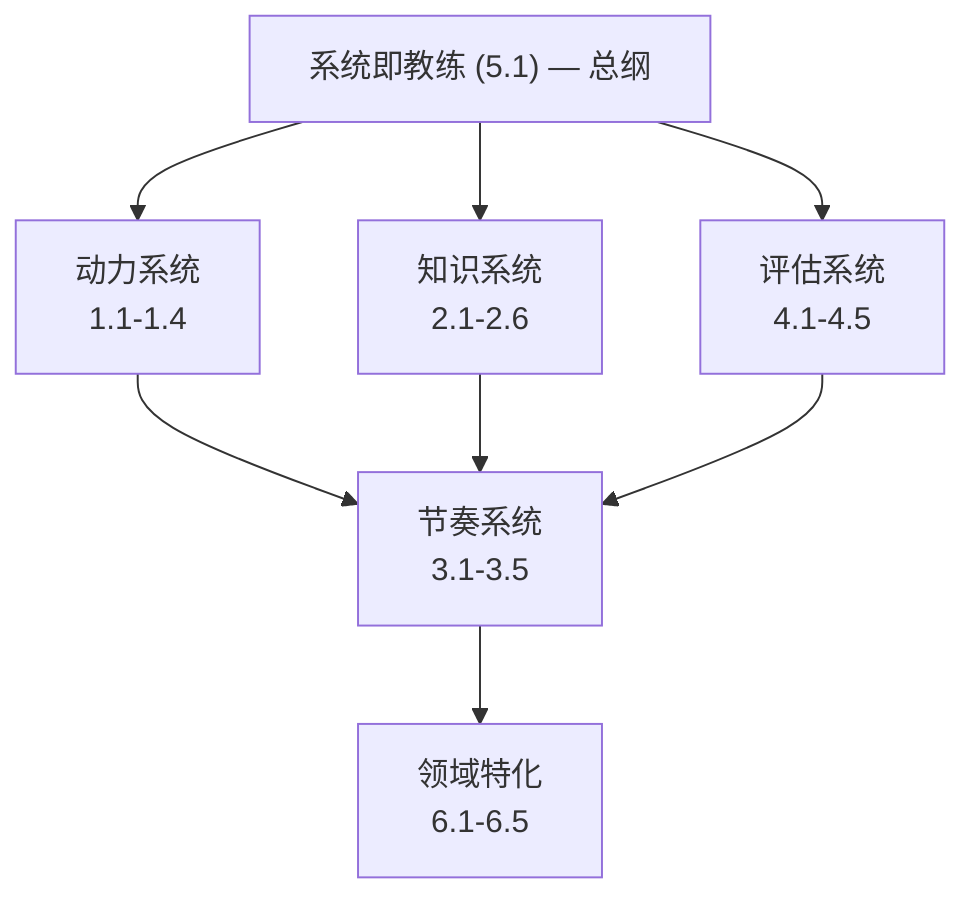

# Training Rules — 训练系统核心原则

> 本文档归纳训练系统背后的所有核心原则，按类别组织。
> 每个原则包含：定义、为什么重要、在系统中的落地方式。

---

## 目录

1. [学习动力与心理学](#1-学习动力与心理学)
2. [知识结构与组织](#2-知识结构与组织)
3. [学习过程与节奏](#3-学习过程与节奏)
4. [评估与反馈](#4-评估与反馈)
5. [系统设计哲学](#5-系统设计哲学)
6. [领域特化：软件工程](#6-领域特化软件工程)

---

## 1. 学习动力与心理学

### 1.1 胜任感驱动 (Competence Motivation)

**定义**：人天生渴望感到「我能行」。高成功率的学习体验产生正向强化，低成功率导致逃避。

**来源**：Self-Determination Theory (Deci & Ryan)

**落地**：
- 默认难度控制在学员最近发展区（Zone of Proximal Development）
- 80% 已知 + 20% 新知作为默认配比
- 任何新知识单元的前几个任务必须让学员能独立完成

---

### 1.2 80/20 小步快跑原则

**定义**：单次学习单元中，80% 是学员已掌握的内容，20% 是新知。步子小、频率高、成功率高的循环能最大化动力维持。

**来源**：Fogg Behavior Model (B=MAP)、Duolingo 的产品实践

**落地**：
- 巡航模式（默认）：80% 旧 + 20% 新，每日高频
- 攻坚模式（按需）：60% 旧 + 40% 新，每周 1-2 次
- 攻坚后必须有巡航恢复期

**约束**：
- 小步快跑适合「启动」和「维持」，不适用于「深度突破」
- 需与 1.3 配合使用

---

### 1.3 理想难度 (Desirable Difficulty)

**定义**：学习中适度的「费力感」虽然当下体验不佳，但长期记忆和迁移效果更好。

**来源**：Robert Bjork 的研究

**落地**：
- 核心知识点必须经历至少一次攻坚模式（高认知挣扎）
- 不应让学员 100% 正确率持续太久——那是浪费时间的信号
- 系统检测到「连续正确率 > 95%」→ 自动提升难度或推进到下一单元

---

### 1.4 多巴胺微脉冲 (Dopamine Micro-pulse)

**定义**：多巴胺在「预期奖励但不确」时释放，不是在获得奖励时。高频「不确定→验证→正确」循环产生持续的动机脉冲。

**来源**：神经科学、游戏化设计

**落地**：
- 每个学习单元拆成 < 5 分钟的子任务
- 每个子任务有即时验证（非延后反馈）
- 场景中的每个决策点都是一个「不确定→验证」脉冲

---

## 2. 知识结构与组织

### 2.1 目标-知识的逆向映射

**定义**：从目标岗位/能力出发，反向拆解所需知识单元（A, B, C...），再组织学习路径。以终为始。

**落地**：
- 输入 = 目标岗位 JD / 能力描述
- 输出 = 知识单元 DAG（有向无环图）
- 每个知识单元有权重（对目标的贡献度）

---

### 2.2 知识依赖图 (Knowledge Graph / DAG)

**定义**：知识点之间有前置依赖关系（拓扑序）。不掌握前置知识就无法理解后续知识。系统必须维护这个图谱并用于路径规划。

**落地**：
- 每个知识节点标注 `prerequisites: [K1, K2, ...]`
- 系统自动做拓扑排序，推荐学习顺序
- 当学员在节点 X 卡住时，系统向上追溯到未掌握的前置节点

---

### 2.3 知识交织性 (Knowledge Intertwining)

**定义**：知识点不是孤立的。学习 A 时发现需要 B 的概念，学 B 时又依赖 C 的直觉。允许学员在知识图谱中「分叉、发散、探索」。

**理论基础**：
- Cognitive Flexibility Theory (Spiro, 1988) — 复杂知识需要 "criss-crossing the landscape"，非线性多次穿越
- Knowledge in Pieces (diSessa, 1993) — 学习不是填充空白，而是重组已有的知识碎片
- Semantic Networks / Spreading Activation (Collins & Loftus, 1975) — 激活一个概念会沿语义网络扩散到相关概念
- Knowledge Space Theory (Doignon & Falmagne, 1985) — 知识依赖关系的数学建模

**落地**：
- 支持非线性的自由探索模式（像 Wikipedia 一样跳转）
- 系统记录学员的实际探索路径为 ForkTree（分叉树，见 `components/forked-learning-trace.md`）
- 事后给出路径优化建议：「你绕路了，A→D→C 更短」
- 复用其他学员的成功路径作为推荐
- 从分叉数据中自动发现隐性依赖 → 修正知识图谱

**详见**：`references.md` §1, `components/forked-learning-trace.md`

---

### 2.4 帕累托原则 (20/80 Knowledge)

**定义**：20% 的知识覆盖 80% 的应用场景。系统的核心价值之一是识别并优先教这 20%。

**落地**：
- 频率法：统计知识点在目标场景的出现频率
- 阻塞法：该知识点是否是其他多个知识的前置
- 区分度法：该知识点在「成功者」vs「未成功者」之间掌握度差异最大
- 时间成本法：投入时间 vs 边际提升的比值

---

### 2.5 知识的三层模型 (L1/L2/L3)

**定义**：知识有三个理解层次：

| 层次 | 名称 | 描述 | 半衰期 |
|------|------|------|--------|
| **L1** | 实用理论 | 具体操作、命令、步骤 | 2-3 年 |
| **L2** | 原理 | 统一解释框架，可推导出实用规则 | 10-15 年 |
| **L3** | 元原理 | 跨域同构的底层规律 | 30+ 年 |

**落地**：
- 默认教到 L2（理解原理），保底 L1（至少能用）
- L3 不主动教，而是「创造连接时刻」让学员自己发现跨域同构
- 学员追问「为什么」超过 2 次 → 触发 L3 内容
- 目标是「能创新/带人/跨域」→ 需要到达 L3

**三层之间的关系**：不是线性递进，而是相互照亮——L3 让你用新的眼睛看 L1，L1 的经验积累为 L3 的顿悟提供原料。

---

### 2.6 理论-实操螺旋 (Theory-Practice Spiral)

**定义**：学概念 → 做练习 → 发现不理解 → 回去补理论 → 再做更难练习。每一轮不是原地转圈，而是在不同抽象层级上升。

**落地**：
- 知识单元的生命周期：初次接触 → 浅层练习 → 场景应用 → 深度卡住 → 触发理论回补 → 场景打通 → 状态升级
- 每次螺旋的理论材料是**升级版**（不是同一份材料重复）
- Round 1: 基础概念 + 标准例题
- Round 2: 概念关联 + 常见误区 + 变式
- Round 3: 边界条件 + 相邻知识区别 + 开放式问题
- Round N: 学员自己总结/教授他人/创造性应用

---

## 3. 学习过程与节奏

### 3.1 宏观-微观场景切换

**定义**：
- **宏观场景**：模拟真实工作/任务流程，保持沉浸感和整体视野
- **微观场景**：针对特定知识缺口，在锁定宏观后深入攻坚

**流程**：
```
宏观场景推进 → 系统检测知识缺口 → 锁定宏观
  → 跳转微观场景（针对性攻坚）→ 达标后解锁
  → 回到宏观继续推进
```

**落地**：
- 触发条件分层：
  - 轻微缺口（正确率 60-80%）→ 软提示，不锁定
  - 严重缺口（正确率 < 60% 或触及核心概念）→ 硬卡点
  - 熟练学员 → 更多事后回溯，减少打断
- 场景不是验证手段，**场景本身就是学习**

---

### 3.2 双模式节奏 (Cruise vs Assault)

| 模式 | 新旧比 | 步幅 | 频率 | 目标 |
|------|--------|------|------|------|
| **巡航** | 80/20 | 小 | 每日 | 维持动力 + 广度覆盖 |
| **攻坚** | 60/40 | 中大 | 每周 1-2 次 | 深度突破核心知识 |

**切换规则**：
- 默认巡航
- 系统检测核心知识点长期表面掌握 → 触发攻坚
- 攻坚后强制缓冲（回到巡航消化）
- 连续正确率 > 95% 且非核心知识 → 加速推进（跳过冗余练习）
- 连续正确率 < 40% → 可能是前置知识缺失 → 回溯而非攻坚

---

### 3.3 最近发展区 (Zone of Proximal Development)

**定义**：任务难度应控制在学员「独自做不了，但在指导下能做」的水平。太难 → 恐慌区（放弃），太简单 → 舒适区（无增长）。

**来源**：Vygotsky

**落地**：
- 系统持续维护每个知识点的掌握概率
- 任务难度 = f(学员当前能力值, 目标掌握概率)
- 动态调整，实时跟随学员状态

---

### 3.4 减少翻译层

**定义**：语言本身就是翻译层。「教练知道的 → 教练能说出的 → 学员听到的 → 学员理解的 → 学员能做的」每一步都有信息损失。减少翻译层 = 让学员直接与对象本身互动。

**落地**：
- 不「讲」Git，让学员在真实仓库里搞砸然后修复
- 不「讲」并发，让学员跑有 race condition 的代码亲眼看到不确定性
- 场景 = 直接互动环境，不是讲稿的包装

---

### 3.5 学习路径复用

**定义**：如果前人走过某条学习路径并成功了，那条路径对后来者有参考价值。好的路径被更多人验证→权重自然更高。

**类比**：Google PageRank——被更多成功路径穿过的知识节点权重更高。

**理论基础**：
- Educational Process Mining (Romero & Ventura, 2010) — 从学习日志中自动发现有效路径模式
- Sequence Mining in Learning (Kinnebrew et al., 2013) — 学习序列聚类出典型行为模式（Systematic / Strategic / Wandering / Hasting）
- Connectivism (Siemens, 2005) — "The pipe is more important than the content" — 导航路径本身就是知识

**落地**：
- 系统记录所有学员的学习路径和结果（完整分叉树，非扁平序列）
- 提取高频成功路径作为推荐
- 标注路径的适用条件（目标岗位、学员背景等）
- 支持「跟随路径」和「自由探索」两种模式
- 分叉路径聚类 → 学习者画像（探索型/依赖型/效率型/迷失型）

**详见**：`references.md` §2-3, `components/forked-learning-trace.md`

---

## 4. 评估与反馈

### 4.1 知识追踪 (Knowledge Tracing)

**定义**：对每个知识点，系统维护一个「学员掌握它的概率」。每次学员答题/操作后，用贝叶斯更新这个概率。

**方法**：
- **BKT (Bayesian Knowledge Tracing)**：经典模型，假设知识状态是二元的（会/不会），每次观测更新概率
- **DKT (Deep Knowledge Tracing)**：用 RNN/LSTM/Transformer 从答题序列预测掌握状态，能捕捉更复杂的模式

**落地**：
- 每个知识节点有 `P(mastered)` 的概率值
- 每次学员在该节点相关题目上的表现 → 更新概率
- 概率 > 阈值（如 0.90）→ 标记为已掌握
- 概率长期不更新 → 触发间隔复习

---

### 4.2 多维归因诊断

**定义**：学员做错了，不只是「错了」。系统需要区分：
- 概念不清（根本不知道这个知识）
- 计算/操作失误（知道但执行出错）
- 审题/场景理解问题（不知道这题在考什么）
- 前置知识缺失（卡在这一步是因为更基础的东西没掌握）

**落地**：
- 每个题目/任务标注考察的知识点和可能出错类型
- 系统收集同一知识点多次表现 → 模式识别
- 错误类型的粒度从「具体知识点」到「抽象能力维度（如逻辑推理）」都覆盖

---

### 4.3 记录-提取-反馈管道

**定义**：原始数据（点击流、答题记录、耗时、犹豫时间）≠ 可用反馈。需要中间的提取/加工层来做归因和模式识别。

```
原始记录 → [提取层] → 结构化洞察 → [反馈生成层] → 学员可理解的反馈
```

**落地**：
- 记录维度：正确率、耗时、犹豫时间（从看到题目到开始作答）、求助次数、跳转路径
- 提取层：归因分析 + 模式识别 + 预测
- 反馈层：自然语言生成 + 可视化 + 可操作建议
- 反馈时效：即时（单个任务）、阶段性（知识单元）、总结性（宏观场景）

---

### 4.4 项目反应理论 (Item Response Theory)

**定义**：不只看「对/错」，还看「题目难度 + 学员能力值 + 猜测概率」。每个题目有三个参数：
- **难度 (b)**：题目本身的难易
- **区分度 (a)**：题目区分高手和低手的能力
- **猜测参数 (c)**：纯猜对的概率

**落地**：
- 用于更精准地评估学员能力值 θ
- 用于校准题目库：淘汰区分度低的题目
- 与知识追踪互补：IRT 评估宏观能力，KT 评估微观知识点

---

### 4.5 认知诊断模型 (Cognitive Diagnosis Model)

**定义**：把每个题目映射到它考察的多个知识点（Q-matrix），从答题结果反推每个知识点的掌握情况。

**落地**：
- 维护 Q-matrix：题目 × 知识点的矩阵
- 一道题做错 → 系统追溯它考察的各个知识点，更新各自的掌握概率
- 比单知识点模型更精确，因为真实场景中几乎不存在只考一个知识点的题目

---

## 5. 系统设计哲学

### 5.1 系统即教练

**定义**：系统不被动记录，而是主动诊断 + 动态干预。它「知道你不知道什么」，并据此调整教学策略。

**区别于传统 LMS**：LMS 是被动记录系统，本系统是主动教练。

**落地**：
- 实时知识状态追踪
- 预测学员后续表现，提前干预
- 动态调整难度、节奏、路径
- 干预决策有依据（基于诊断模型，非硬编码规则）

---

### 5.2 场景即学习

**定义**：场景不是学完后的「验证」，而是学习发生的「场所」。学员在场景中遇到问题 → 发现知识缺口 → 补知识 → 回到场景应用 → 真正学会。

**落地**：
- 宏观场景是学习的主线，不是测验
- 知识单元的引入由场景需求触发，而非课程大纲顺序
- 即使学员在场景中「失败」了，只要后续补上了知识，就是成功的学习

---

### 5.3 数据飞轮

**定义**：系统从所有学员的数据中学习 → 路径推荐更准 → 20% 关键知识识别更精 → 干预时机更恰当 → 更多学员成功 → 更多数据。

这是系统相对传统教育的核心护城河——越用越好。

**落地**：
- 收集维度：学习路径、正确率、耗时、最终结果（是否达到目标）
- 分析层：哪些路径转化率高？哪些知识点区分度大？哪些干预有效？
- 应用层：持续更新知识权重、路径推荐、难度校准

---

### 5.4 插件化/可扩展

**定义**：核心训练引擎是通用的，但训练规则、领域知识、场景内容、评估标准都是可插拔的。

**落地**：
- Training Plugin = 一组训练规则的打包（知识图谱 + 评估规则 + 节奏规则 + 场景模板）
- Domain Plugin = 特定领域的知识结构定义
- Content Plugin = 具体的教学材料
- 详见 `architecture.md`

---

## 6. 领域特化：软件工程

### 6.1 心智模型构建

**定义**：软件不可见。软件工程师的核心能力是在脑子里建立系统的准确内部表征（心智模型），并能在其上做模拟运行。

**落地**：
- 训练任务：读代码 → 画结构 → 跑起来验证
- 训练任务：给有 bug 的系统，不读源码，通过外部行为推断 bug 位置
- 训练任务：给变更，预测影响范围，再验证

---

### 6.2 调试的系统性方法

**定义**：软件的日常不是写新代码，而是理解为什么现有代码不按预期工作。这个能力几乎不被任何课程体系覆盖，却是工作和面试最看重的实际能力。

**落地**：
- 场景设计大量使用「故障注入」模式
- 训练「发现问题 → 缩小范围 → 形成假设 → 验证假设 → 修复」的肌肉记忆
- 不是灵光一闪，而是可复用的方法论

---

### 6.3 设计-实现不可分离

**定义**：软件工程师同时是建筑师和施工队。设计和实现不能分两门课教——它们在学习过程中必须交织。

**落地**：
- 不分离「设计课」和「编码课」
- 每个训练单元同时包含设计决策和编码实现
- 代码审查（code review）作为核心训练手段——读别人的代码，评判设计，提出改进

---

### 6.4 工具-原理动态平衡

**定义**：软件工具半衰期 2-3 年，原理半衰期 10-15 年。必须两者都教，并让学员自己发现工具背后的原理。

**落地**：
- 教一个框架的同时，揭示背后的原理（组件化、响应式、虚拟 DOM 等）
- 让学员意识到不同框架只是同一原理的不同实现
- 最终目标：新框架出现时，一周能上手

---

### 6.5 持续学习元能力

**定义**：软件变化是常态。培训目标不是「学会 X」，而是「拥有学会任何 X 的能力」。

**落地**：
- 场景中刻意引入学员没见过的新工具/新概念
- 评估「多久能上手新东西」而非「记住了多少旧东西」
- 训练信息检索、文档阅读、社区提问等元技能

---

## 附录：原则之间的依赖关系



- **动力系统**决定了学员会不会开始、会不会坚持
- **知识系统**决定了学什么、以什么结构学
- **评估系统**决定了系统如何「感知」学员状态
- **节奏系统**在三者之上做编排——什么时候快、什么时候慢、什么时候攻坚
- **领域特化**是以上四层在特定领域的投影
