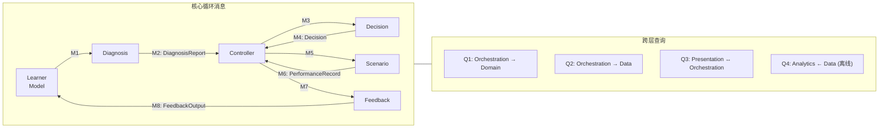

# Interface Specification — 接口契约定义

> 纯数据契约。YAML 定义每一条消息、每一个查询、每一个返回值。
> 不包含实现细节——没有函数签名、没有方法、没有代码。
>
> **配套 Mermaid 流程图**: 见 `architecture.md` 中的核心循环图、分层架构图、数据模型图、部署图

---

## 目录

1. [契约总览](#1-契约总览)
2. [核心循环消息 (M1–M8)](#2-核心循环消息)
3. [跨层查询 (Q1–Q4)](#3-跨层查询)
4. [Plugin 数据契约 (P1–P5)](#4-plugin-数据契约)
5. [分叉追踪 (F1–F4)](#5-分叉追踪)
6. [错误与降级](#6-错误与降级)
7. [版本兼容性](#7-版本兼容性)

---

## 1. 契约总览



**契约类型**：
- **M1–M8**：核心循环中的消息（内存传递，每次 tick 产生一份）
- **Q1–Q4**：跨层查询（请求-响应，可能异步）
- **P1–P5**：Plugin 必须提供的数据（YAML 文件或等价的查询响应）
- **F1–F4**：分叉追踪扩展

---

## 2. 核心循环消息 (M1–M8)

> 对应 `architecture.md` §1 状态机中的状态转换。
> 每条消息在特定状态下产生和消费。

### M0: SessionState（Controller 持有，Engine 不可见）

```yaml
# 这是状态机本身的数据——Engine 不感知它。
# 放在这里因为所有 M1-M8 的流转都由它控制。

SessionState:
  session_id: string
  learner_id: string
  
  current: "IDLE" | "DIAGNOSING" | "DECIDING" | "EXECUTING" | "FEEDBACK"
          | "PAUSED" | "DEGRADED_DIAG" | "DEGRADED_DEC" | "DEGRADED_FB" | "TERMINATED"
  previous: string
  
  pending:
    message: "M1" | "M3" | "M5" | "M7" | null
    sent_at: "2025-01-15T10:35:00Z"
    timeout_ms: 500
    retry_count: 0
    
  degraded:
    active: false
    reason: null
    consecutive_degraded_ticks: 0
    consecutive_successful_ticks: 0
    incident_id: null
    
  checkpoint:
    scenario_id: null
    phase_id: null
    decision_point_id: null
    knowledge_snapshot: null
    context_variables: null
    saved_at: null
    
  stats:
    total_ticks: 0
    degraded_ticks: 0
    avg_processing_ms: 0.0
```

### M1: DiagnosisInput

```yaml
# 方向: Controller → Diagnosis Engine
# 时机: 学员完成一个 decision_point 或 exercise 后
# 约束: Diagnosis Engine 不修改此消息中的任何数据

DiagnosisInput:
  learner_id: string
  
  # 学员当前全部知识状态（快照）
  knowledge_state:
    K_break_even:
      p_mastery: 0.32
      depth_level: 1
      spiral_round: 2
      practice_count: 7
      last_practiced: "2025-01-15T10:30:00Z"
    # ... 所有目标知识节点
    
  # 最新一条操作记录
  latest_performance:
    record_id: "rec_0042"
    timestamp: "2025-01-15T10:35:00Z"
    scenario_id: "macro_new_product_launch"
    phase_id: "phase_3_pricing"
    task_id: "decision_break_even_calc"
    learner_action:
      type: "answer"
      input: { price: 48, quantity: 15000 }
      hint_used: false
    result:
      correct: false
      score: 0.3
      expected_answer: { price: 55, quantity: 12000 }
      intermediate_steps_correct: 0.6
    timing:
      total_time_sec: 145
      hesitation_before_start_ms: 8500
      hesitation_between_steps_ms: [3200, 4100]
    fork_event: null
    knowledge_tested: ["K_break_even", "K_cost_structure"]
    
  # 上下文
  context:
    active_scenario_id: "macro_new_product_launch"
    active_phase_id: "phase_3_pricing"
    decision_point_id: "decision_break_even_calc"
    pacing_mode: "cruise"
    
  # 可选：A/B 测试参数覆盖
  bkt_params_override: null
```

### M2: DiagnosisReport

```yaml
# 方向: Diagnosis Engine → Controller
# 约束: 不包含「下一步该做什么」——那是 M4 的职责

DiagnosisReport:
  # 更新后的知识状态（BKT 更新后的 p_mastery）
  updated_knowledge_state:
    K_break_even:
      p_mastery: 0.28       # 从 0.32 降到 0.28（做错了）
      # 其余字段不变，由 Controller 合并
    K_cost_structure:
      p_mastery: 0.75       # 从 0.72 升到 0.75（这部分做对了）
      
  # 检测到的缺口
  knowledge_gaps:
    - node_id: "K_break_even"
      p_mastery: 0.28
      severity: "critical"
      attribution: "concept"
      evidence:
        - task_id: "decision_break_even_calc"
          error_type: "formula_misapplied"
          timestamp: "2025-01-15T10:35:00Z"
        - task_id: "ex_break_even_03"
          error_type: "misidentified_problem_type"
          timestamp: "2025-01-15T10:20:00Z"
          
  # 整体评估
  overall_state:
    current_zone: "stretch"          # comfort | stretch | panic
    motivation_index: 0.72
    recommended_mode: "assault"       # 建议切换到攻坚（因为核心知识 critical gap）
    
  # 诊断元数据
  diagnosis_metadata:
    diagnosis_time_ms: 45
    bkt_version: "1.0"
    error_classifier_version: "1.2"
```

### M3: DecisionInput

```yaml
# 方向: Controller → Decision Engine
# 约束: Decision Engine 不修改任何输入，只产出 Decision

DecisionInput:
  diagnosis: <M2_DiagnosisReport>
  
  learner_state:
    # 合并了 M2 的 updated_knowledge_state 后的完整 LearnerModel
    # 包含: profile, goal, knowledge_state, learning_history,
    #       motivation_metrics, current_state
    
  rules:
    pacing: <PacingRules>         # 来自 TrainingPlugin
    assessment: <AssessmentRules> # 来自 TrainingPlugin
    
  goal: <GoalConfig>
  
  scenario_context:
    active_scenario_id: "macro_new_product_launch"
    active_phase_id: "phase_3_pricing"
    decision_point_id: "decision_break_even_calc"
    remaining_decision_points: ["decision_final_price"]
    current_fork_depth: 0         # 当前分叉嵌套深度
```

### M4: Decision

```yaml
# 方向: Decision Engine → Controller

Decision:
  action: "jump_to_micro"
  # 完整枚举:
  #   continue          — 继续当前场景，无干预
  #   hint              — 软提示，不锁定场景
  #   jump_to_micro     — 锁定宏观，跳转微观场景
  #   unlock_macro      — 微观达标，解锁回到宏观
  #   skip              — 跳过当前节点
  #   retry             — 重试当前决策点
  #   suggest_fork      — 系统建议探索某概念
  #   force_backtrack   — 缺口追溯到更前置的知识
  #   complete_scenario — 场景完成，进入反馈
  
  target:
    scenario_id: "micro_break_even_calc"
    difficulty_params:
      new_old_ratio: 0.35
      time_limit_sec: null
      hints_available: 1
      distractor_strength: "medium"
      
  pacing_mode: "assault"
  
  rationale: >
    Critical gap on core node K_break_even (p=0.28).
    3 consecutive concept-level errors.
    Prerequisites K_cost_structure verified OK (p=0.75).
    Action: lock macro → micro scenario → assault mode.
    
  hint_for_learner: null   # 如果 action == hint，这里提供提示文本
```

### M5: ScenarioInput

```yaml
# 方向: Controller → Scenario Engine

ScenarioInput:
  decision: <M4_Decision>
  learner_state: <LearnerModel>
  
  # 场景定义（从 Domain Layer 的 ScenarioBank 查询得到）
  scenario_def: <ScenarioDef>
  
  # 场景具体内容（从 Data Layer 的 ContentStore 查询得到）
  scenario_content: <ScenarioContent>
```

### M6: PerformanceRecord

```yaml
# 方向: Scenario Engine → Controller
# 每完成一个 decision_point / exercise 产生一份
# 不可变——只追加，不修改

PerformanceRecord:
  record_id: "rec_0042"
  learner_id: "learner_123"
  session_id: "session_20250115"
  timestamp: "2025-01-15T10:35:00Z"
  
  context:
    scenario_id: "macro_new_product_launch"
    phase_id: "phase_3_pricing"
    task_id: "decision_break_even_calc"
    
  learner_action:
    type: "answer"                      # answer | skip | request_hint
                                        # | fork_to_explore | return_from_fork
    input: { price: 48, quantity: 15000 }
    hint_used: false
    hint_index: null
    
  result:
    correct: false
    score: 0.3
    expected_answer: { price: 55, quantity: 12000 }
    intermediate_steps_correct: 0.6
    
  timing:
    total_time_sec: 145
    hesitation_before_start_ms: 8500
    hesitation_between_steps_ms: [3200, 4100]
    
  # 分叉事件（仅当 learner_action.type 包含 fork 时有值）
  fork_event: null
  
  knowledge_tested: ["K_break_even", "K_cost_structure"]
```

### M7: FeedbackInput

```yaml
# 方向: Controller → Feedback Engine

FeedbackInput:
  level: "phase"            # instant | phase | summary | final
  performance_records: [<M6_PerformanceRecord>, ...]
  diagnosis: <M2_DiagnosisReport>
  learner_state: <LearnerModel>
  feedback_config: <FeedbackConfig>   # 来自 TrainingPlugin
```

### M8: FeedbackOutput

```yaml
# 方向: Feedback Engine → Controller
# Controller 负责: (a) 把 learner_feedback 推给 Presentation
#                  (b) 把 learner_model_patch 写回 Data Layer
#                  (c) 把 fork_trace_update 写回 Data Layer

FeedbackOutput:
  # ── 面向学员 ──
  learner_feedback:
    level: "phase"
    title: "盈亏平衡分析 — 阶段反馈"
    content: >
      ## 进度
      完成 3/4 道决策。正确率 33%。
      
      ## 你做得好的
      ✅ 固定成本与可变成本的区分——全部正确。
      
      ## 需要加强的
      ⚠️ 盈亏平衡点计算：公式套用有误。
      你理解了概念，但在区分「单价」和「单位可变成本」时容易混淆。
      
      ## 下一步
      系统将带你进入一个专项练习（约 10 分钟），
      聚焦盈亏平衡公式的精确使用。
      
    visualizations:
      - type: "progress_bar"
        data:
          label: "盈亏平衡掌握度"
          before: 0.32
          after: 0.28
          target: 0.85
          
    actions:
      - label: "开始专项练习"
        action_type: "next_scenario"
        target: "micro_break_even_calc"
        
  # ── 写回 ──
  learner_model_patch: null    # 阶段反馈不修改模型（模型已在 M2 更新）
  
  fork_trace_update: null
```

---

## 3. 跨层查询 (Q1–Q4)

### Q1: Domain Layer 查询

```yaml
# ── Q1a: 知识图谱查询 ──

# 请求
KnowledgeGraphQuery:
  type: "get_prerequisites" | "get_dependents" | "get_node"
       | "topological_sort" | "get_recommended_paths" | "get_inferred_edges"
  params:
    node_id: "K_break_even"            # 针对 get_prerequisites / get_dependents / get_node
    recursive: true                     # 是否递归获取所有祖先依赖
    target_nodes: ["K_break_even", "K_pricing_strategy"]  # 针对 topological_sort
    goal_template: "junior_swe"         # 针对 get_recommended_paths
    learner_background: { cs_degree: false, years_exp: 0 }  # 针对 get_recommended_paths
    min_confidence: 0.4                 # 针对 get_inferred_edges

# 响应: get_prerequisites
KnowledgeGraphResponse:
  node_id: "K_break_even"
  prerequisites:
    direct: ["K_cost_structure", "K_algebra_basics"]
    all: ["K_cost_structure", "K_algebra_basics", "K_arithmetic"]
    
# 响应: get_recommended_paths
KnowledgeGraphResponse:
  paths:
    - name: "标准路径"
      sequence: ["K_git", "K_python", "K_data_structures", "K_algorithms"]
      success_rate: 0.85
      estimated_hours: 120
      match_score: 0.78
    - name: "实践优先"
      sequence: ["K_git", "K_sql", "K_web_basics", "K_data_structures"]
      success_rate: 0.72
      estimated_hours: 100
      match_score: 0.92

# ── Q1b: 评估规则查询 ──

AssessmentRulesQuery:
  type: "get_bkt_params" | "get_qmatrix_row" | "get_thresholds"
  params:
    node_id: "K_data_structures"   # 针对 get_bkt_params
    task_id: "decision_break_even_calc"  # 针对 get_qmatrix_row

AssessmentRulesResponse:
  bkt_params:
    p_initial: 0.15
    p_learn: 0.30
    p_guess: 0.15
    p_slip: 0.10
  # 或
  qmatrix_row:
    K_break_even: 0.6
    K_cost_structure: 0.4
  # 或
  thresholds:
    mastery: 0.90
    decay: 0.60
    decay_rate_per_week: 0.05

# ── Q1c: 节奏规则查询 ──

PacingRulesQuery:
  type: "get_mode_params" | "evaluate_transition" | "should_skip"
  params:
    mode: "cruise"                  # 针对 get_mode_params
    current_mode: "cruise"          # 针对 evaluate_transition
    learner_state: <LearnerModel>   # 针对 evaluate_transition / should_skip
    node_id: "K_git_basics"         # 针对 should_skip

PacingRulesResponse:
  mode_params:
    new_old_ratio: 0.20
    task_duration_max_sec: 300
    feedback_delay: "instant"
    hints_allowed: 2
  # 或
  next_mode: "assault"   # evaluate_transition 的结果
  # 或
  should_skip: true      # should_skip 的结果

# ── Q1d: 场景模板查询 ──

ScenarioBankQuery:
  type: "get_scenario_def" | "get_micro_map" | "get_next_macro"
  params:
    scenario_id: "macro_new_product_launch"
    macro_id: "macro_new_product_launch"   # 针对 get_micro_map
    learner_state: <LearnerModel>           # 针对 get_next_macro

ScenarioBankResponse:
  scenario_def:
    id: "macro_new_product_launch"
    type: "macro"
    name: "新产品全球发布会"
    estimated_duration_min: 45
    knowledge_coverage: ["K_market_analysis", "K_pricing_strategy", "K_break_even"]
    phases: [...]  # 完整 phase 结构，不含具体文本内容
    micro_scenarios:
      K_break_even: "micro_break_even_calc"
      K_pricing_strategy: "micro_pricing_models"
```

### Q2: Data Layer 查询

```yaml
# ── Q2a: Learner Store ──

# 读取
LearnerReadQuery:
  type: "get_learner" | "get_knowledge_state" | "get_history" | "get_fork_trace"
  params:
    learner_id: "learner_123"
    node_ids: ["K_break_even"]           # 仅 get_knowledge_state
    session_id: "session_20250115"       # 仅 get_fork_trace

LearnerReadResponse:
  # get_learner → 完整 LearnerModel
  # get_knowledge_state → Map<node_id, KnowledgeNodeState>
  # get_history → LearningHistory
  # get_fork_trace → ForkTrace | null

# 写入
LearnerWriteCommand:
  type: "save_learner" | "append_record" | "update_knowledge_state" | "save_fork_trace"
  payload:
    learner: <LearnerModel>                          # save_learner
    record: <LearningRecord>                         # append_record
    knowledge_updates:                                # update_knowledge_state
      K_break_even: { p_mastery: 0.28 }
    fork_trace: <ForkTrace>                          # save_fork_trace
  # 乐观锁
  expected_version: 7

LearnerWriteResponse:
  success: true
  new_version: 8
  # 或冲突
  # success: false
  # conflict: true
  # current_version: 9

# ── Q2b: Content Store ──

ContentQuery:
  type: "get_theory" | "get_exercise" | "get_scenario_content" | "get_exercises_for_node"
  params:
    material_ref: "mat_data_structures_L1"
    exercise_id: "ex_array_01"
    scenario_id: "macro_new_product_launch"
    node_id: "K_break_even"
    difficulty: 2

ContentResponse:
  # get_theory → TheoryMaterial
  title: "数据结构：从数组到哈希表"
  format: "interactive_text"
  sections: [...]
  # get_exercise → Exercise
  # get_scenario_content → ScenarioContent (场景内具体文本、对话、数据)
  # get_exercises_for_node → Exercise[]
```

### Q3: Presentation 查询

```yaml
# ── Q3a: Scenario Rendering ──

ScenarioRenderRequest:
  scenario_id: "macro_new_product_launch"
  phase_id: "phase_3_pricing"
  decision_point_id: "decision_break_even_calc"
  scenario_def: <ScenarioDef>       # 结构
  scenario_content: <ScenarioContent>  # 文本/数据
  render_params:
    learner_name: "张三"
    scenario_context_vars:
      fixed_cost: 500000
      variable_cost_per_unit: 30
      market_size_estimate: 50000
    difficulty_params:
      new_old_ratio: 0.20
      hints_available: 2
    pacing_mode: "cruise"
    
ScenarioRenderResponse:
  layout:
    type: "decision_point"
    role_prompt: "作为产品负责人，你需要..."     # 场景描述文本
    data_panels:                                 # 数据展示面板
      - title: "财务部数据"
        content: "固定成本: $500K | 可变成本: $30/unit"
      - title: "市场部数据"
        content: "预计市场规模: 50K units | 竞品均价: $45-60"
    input_area:
      type: "structured_form"
      fields:
        - id: "price"
          label: "建议零售价 ($)"
          type: "number"
          min: 1
          max: 200
        - id: "quantity"
          label: "预计销量 (units)"
          type: "number"
    hints_remaining: 2
    fork_links:                                   # 可点击的知识概念
      - concept: "固定成本"
        node_id: "K_fixed_cost"
      - concept: "可变成本"
        node_id: "K_variable_cost"

# ── Q3b: Feedback Rendering ──

FeedbackRenderRequest:
  feedback: <LearnerFeedback>     # 来自 M8
  
FeedbackRenderResponse:
  layout:
    type: "phase_feedback"
    title: "盈亏平衡分析 — 阶段反馈"
    sections:
      - type: "markdown"
        content: "## 进度\n完成 3/4 道决策..."
      - type: "chart"
        chart_type: "progress_bar"
        data: { before: 0.32, after: 0.28, target: 0.85 }
    action_buttons:
      - label: "开始专项练习"
        action_type: "next_scenario"
        target: "micro_break_even_calc"
        style: "primary"
```

### Q4: Analytics 查询 (只读, 离线)

```yaml
# Analytics Worker 从 Data Layer 批量读取，产出聚合数据

AnalyticsBatchQuery:
  time_window:
    start: "2025-01-01T00:00:00Z"
    end: "2025-01-15T00:00:00Z"
  type: "learning_records" | "learner_snapshots"
  
AnalyticsBatchResponse:
  records: [<LearningRecord>, ...]
  
# 聚合结果写回
AnalyticsWriteCommand:
  type: "update_path_stats" | "update_node_coverage" | "update_fork_patterns"
  payload:
    path_stats:
      goal: "junior_swe"
      paths: [...]
    node_coverage:
      K_break_even:
        practical_coverage: 0.18
        self_containment: 0.65
    fork_patterns:
      K_break_even:
        top_forks:
          - to_node: "K_cost_structure"
            ratio: 0.45
            avg_perf_delta: 0.12
        learner_profiles: [...]
    inferred_edges:
      - from: "K_cost_structure"
        to: "K_break_even"          # K_cost_structure 是 K_break_even 的隐性前置
        confidence: 0.72
        evidence_count: 87
```

---

## 4. Plugin 数据契约 (P1–P5)

每个 Plugin 是一个目录，包含以下 YAML 文件。加载时校验。

### P1: TrainingPlugin

```yaml
# my-training-plugin/plugin.yaml
id: "swe-junior-v1"
name: "初级软件工程师训练插件"
version: "1.0.0"
rules_version: "1.0"                    # 对应的 training_rules.md 版本
compatible_core_versions: [">=1.0.0"]   # 兼容的核心引擎版本
author: "..."
description: "..."

# 声明这个插件提供的子组件
provides:
  knowledge_graph: "knowledge_graph.yaml"
  assessment_rules: "assessment_rules.yaml"
  pacing_rules: "pacing_rules.yaml"
  scenario_templates: "scenarios/"
  feedback_config: "feedback_config.yaml"
  
# 依赖的其他插件（可选）
depends_on:
  domain: "domain_software_engineering"  # 引用 DomainPlugin
  content: "content_swe_v1"             # 引用 ContentPlugin
```

### P2: DomainPlugin

```yaml
# domain_software_engineering/plugin.yaml
id: "domain_software_engineering"
name: "软件工程领域定义"
version: "2.1.0"

# domain_software_engineering/knowledge_nodes.yaml
# 完整的知识节点定义（所有可能的知识点）
nodes:
  K_git_basics:
    name: "Git 基础操作"
    category: "tools"
    difficulty: 1
    estimated_hours: 4
    prerequisites: []
    children: []
    
  K_git_branching:
    name: "Git 分支策略"
    category: "tools"
    difficulty: 2
    estimated_hours: 6
    prerequisites: ["K_git_basics"]
    
  # ... 数百个节点

# domain_software_engineering/edges.yaml
edges:
  - from: "K_git_basics"
    to: "K_git_branching"
    type: "prerequisite"
  - from: "K_sql"
    to: "K_data_structures"
    type: "related"
    description: "索引原理需要理解 B+ 树"

# domain_software_engineering/goal_templates.yaml
goal_templates:
  junior_swe:
    name: "初级软件工程师"
    required_nodes:
      - node_id: "K_git_basics"
        depth_target: 2
        weight: 0.8
        is_core: false
      - node_id: "K_data_structures"
        depth_target: 2
        weight: 0.95
        is_core: true
      # ...
      
  senior_swe:
    name: "高级软件工程师"
    required_nodes:
      # ...
```

### P3: ContentPlugin

```yaml
# content_swe_v1/plugin.yaml
id: "content_swe_v1"
name: "软件工程教学内容包 v1"
domain: "domain_software_engineering"
version: "1.3.0"

# content_swe_v1/q_matrix.yaml
# Q-Matrix: 每个题目 → 考察的知识点（权重）
q_matrix:
  decision_break_even_calc:
    K_break_even: 0.6
    K_cost_structure: 0.3
    K_algebra_basics: 0.1
  ex_array_01:
    K_array_list: 1.0
  ex_hashmap_03:
    K_hash_map: 0.5
    K_collision_resolution: 0.5
  # ...

# content_swe_v1/materials.yaml
# 教学材料索引（实际内容在独立文件中）
materials:
  K_data_structures:
    L1:
      ref: "materials/data_structures/L1.md"
      format: "interactive_text"
      estimated_minutes: 45
    L2:
      ref: "materials/data_structures/L2.md"
      format: "interactive_text"
      estimated_minutes: 60
    L3:
      ref: "materials/data_structures/L3.md"
      format: "cross_domain_connection"
      estimated_minutes: 30
      connections:
        - "数据库索引 → B+ 树"
        - "CPU 缓存 → 数组的缓存友好性"
        - "Git → 哈希表的极致应用"

# content_swe_v1/exercises.yaml
exercises:
  ex_array_01:
    node_ids: ["K_array_list"]
    difficulty: 1
    type: "code_writing"
    content_ref: "exercises/array_01.md"
    solution_ref: "solutions/array_01.py"
    test_cases_ref: "tests/array_01.py"

# content_swe_v1/scenarios/
#   macro_new_product_launch.yaml  — 场景内具体文本、对话、数据
#   micro_break_even_calc.yaml
#   sandbox_debugging_practice.yaml
```

### P4: DiagnosisPlugin（可选）

```yaml
# diagnosis_enhanced/plugin.yaml
id: "diagnosis_enhanced"
name: "增强诊断插件"
version: "1.0.0"

# 声明替换核心引擎的哪些部分
overrides:
  knowledge_tracer: "dkt"              # 替换默认 BKT 为 Deep KT
  error_classifier: "ml_classifier"    # 替换规则分类器为 ML 模型
  motivation_detector: "default"       # 保留默认

# diagnosis_enhanced/bkt_params.yaml
bkt_defaults:
  p_initial: 0.15
  p_learn: 0.30
  p_guess: 0.15
  p_slip: 0.10

node_overrides:
  K_data_structures:
    p_initial: 0.10
    p_learn: 0.20

# diagnosis_enhanced/error_classification_rules.yaml
rules:
  - condition: "prerequisite_p_mastery < 0.5"
    attribution: "prerequisite"
    confidence: 0.80
  - condition: "hesitation > avg * 1.5 AND answer_relevance < 0.3"
    attribution: "comprehension"
    confidence: 0.70
  - condition: "intermediate_correct > 0.7 AND final_correct == false"
    attribution: "calculation"
    confidence: 0.85
  - condition: "default"
    attribution: "concept"
    confidence: 0.60
```

### P5: FeedbackPlugin（可选）

```yaml
# feedback_custom/plugin.yaml
id: "feedback_custom"
name: "自定义反馈插件"
version: "1.0.0"

# feedback_custom/templates/
#   instant_correct.yaml
#   instant_wrong.yaml
#   phase_feedback.yaml
#   summary_feedback.yaml
#   final_report.yaml

# feedback_custom/templates/instant_wrong.yaml
templates:
  cruise:
    - "方向不太对。提示: {hint}"
    - "再想想？关键在 {key_concept}"
  assault:
    - "不对。再试一次。"
  recover:
    - "没关系，试试这个思路: {hint}"
```

---

## 5. 分叉追踪 (F1–F4)

### F1: ForkEvent（嵌入 M6 PerformanceRecord）

```yaml
# 当学员点击知识链接或搜索概念时，PerformanceRecord.fork_event 被填充

# ── 分叉出去 ──
ForkEvent:
  type: "fork_out"
  from_node: "K_break_even"
  to_node: "K_fixed_cost"
  trigger_concept: "固定成本"
  parent_context: "BEP 公式中的 FC 参数含义"
  timestamp: "2025-01-15T10:36:00Z"

# ── 分叉返回 ──
ForkEvent:
  type: "fork_return"
  fork_node_id: "fork_0042_01"
  from_node: "K_fixed_cost"
  to_node: "K_break_even"
  outcome: "mastered"
  duration_sec: 420
  parent_performance_before: 0.32
  parent_performance_after: 0.38
  timestamp: "2025-01-15T10:43:00Z"
```

### F2: ForkTrace（存储在 LearnerModel 中）

```yaml
# 完整的分叉树——学员学习的真实轨迹
ForkTrace:
  learner_id: "learner_123"
  session_id: "session_20250115"
  root:
    node_id: "K_break_even"
    entry_reason: "scenario_required"
    started_at: "2025-01-15T10:30:00Z"
    ended_at: "2025-01-15T10:55:00Z"
    duration_sec: 1500
    outcome: "mastered"
    return_to_parent: false     # root 没有 parent
    forks:
      - node_id: "K_fixed_cost"
        entry_reason: "learner_explore"
        trigger_concept: "固定成本"
        parent_context: "BEP 公式中 FC 的含义"
        started_at: "2025-01-15T10:36:00Z"
        ended_at: "2025-01-15T10:43:00Z"
        duration_sec: 420
        outcome: "mastered"
        return_to_parent: true
        parent_performance_delta: 0.06
        forks:
          - node_id: "K_sunk_cost"
            entry_reason: "learner_curious"
            trigger_concept: "沉没成本 ≠ 固定成本"
            parent_context: "区分两者时产生的疑问"
            started_at: "2025-01-15T10:38:00Z"
            ended_at: "2025-01-15T10:41:00Z"
            duration_sec: 180
            outcome: "partial"
            return_to_parent: true
            parent_performance_delta: 0.02
            forks: []
            
  summary:
    total_nodes_visited: 4
    max_depth: 2
    total_forks: 2
    by_reason:
      system_intervention: 0
      learner_explore: 1
      learner_curious: 1
    return_rate: 1.0
    avg_fork_duration_sec: 300
```

### F3: ForkProfile（分叉画像 — Diagnosis Engine 产出）

```yaml
# 从 ForkTrace 历史中聚合出的学员分叉行为画像
ForkProfile:
  learner_id: "learner_123"
  type: "explorer"                    # dependent | explorer | efficient | lost
  metrics:
    avg_fork_depth: 1.8
    return_rate: 0.85                 # 多少分叉最终回到主线
    system_vs_self_ratio: 0.3         # < 1 = 更多自主分叉
    fork_effectiveness: 0.12          # 分叉后主线表现的平均改善
  signals:
    high_curiosity: true              # learner_curious 占比 > 30%
    prone_to_lost: false              # return_rate > 0.7
    needs_scaffolding: false          # system_intervention 占比低
```

### F4: InferredEdge（Analytics 产出 → 写回 Knowledge Graph）

```yaml
# 从所有学员的分叉数据中挖掘的隐性依赖
InferredEdge:
  from: "K_cost_structure"            # 前置知识
  to: "K_break_even"                  # 依赖它的知识
  type: "inferred_prerequisite"
  confidence: 0.72
  evidence:
    total_learners: 250
    forked_from_A_to_B: 112           # 学 break_even 时主动分叉去 cost_structure
    fork_ratio: 0.45                  # 45% 的学员有此分叉
    avg_perf_delta: 0.14              # 分叉返回后 break_even 掌握度平均提升 0.14
  status: "suggested"                 # suggested | accepted | rejected
  suggested_at: "2025-01-20T00:00:00Z"
```

---

## 6. 错误与降级

> 对应 `architecture.md` §1 状态机中的 DEGRADED_* 状态。
> 每个 Engine 是纯函数——遇到错误不抛异常，返回 ErrorReport。
> Controller 根据 ErrorReport 和当前 SessionState 决定状态转换。

### 6.1 ErrorReport — Engine 的错误输出

```yaml
# 每个 Engine 在遇到无法处理的错误时，产出 ErrorReport 而非正常输出。

ErrorReport:
  source: "DiagnosisEngine"          # 哪个组件出错
  error_type:
    # 超时类
    - "timeout"                       # Engine 在规定时间内未返回
    # 数据类
    - "bkt_update_failed"             # BKT 计算异常（如除零）
    - "missing_prerequisite_data"     # 前置知识节点在 LearnerModel 中不存在
    - "content_not_found"             # 场景材料/题目不存在
    - "scenario_load_failed"          # 场景定义解析失败
    # 插件类
    - "plugin_incompatible"           # Plugin 版本不兼容
    - "plugin_not_found"              # 依赖的 Plugin 未加载
    # 存储类
    - "learner_store_write_failed"   # LearnerStore 写入失败
    - "learner_store_read_failed"    # LearnerStore 读取失败
    # 未知
    - "unknown"
    
  message: "BKT update failed for node K_break_even: division by zero in p_learn calculation"
  
  context:
    learner_id: "learner_123"
    session_id: "session_20250115"
    scenario_id: "macro_new_product_launch"
    state_when_failed: "DIAGNOSING"   # 出错时 Controller 的状态
    
  # Engine 建议的降级动作（Controller 拥有最终决定权）
  suggested_fallback:
    action: "use_stale_state"         # 具体枚举见 §6.2
    params:
      p_mastery_unchanged: true
```

### 6.2 降级动作枚举与适用场景

```yaml
degraded_actions:
  use_stale_state:
    description: "不更新知识状态，使用上一次有效的 p_mastery"
    applies_to: ["DIAGNOSING"]
    effect: "gap_severity 全部降级为 moderate → 系统保守运行"
    
  use_default_params:
    description: "使用默认 BKT 参数 (p_initial=0.5) 代替节点特定参数"
    applies_to: ["DIAGNOSING"]
    effect: "诊断精度下降，但不阻塞流程"
    
  force_continue:
    description: "跳过诊断和决策，直接 action=continue, pacing=cruise"
    applies_to: ["DECIDING"]
    effect: "学员无感知——场景继续，但缺口检测暂停"
    
  skip_scenario:
    description: "跳过当前场景/决策点，推进到下一个"
    applies_to: ["EXECUTING"]
    effect: "学员看到 '此环节暂时跳过' 提示，不扣分"
    
  enqueue_retry:
    description: "写回失败时，将 patch 推入重试队列 (3 次指数退避)"
    applies_to: ["FEEDBACK"]
    effect: "学员看到反馈（从缓存），写回在后台重试"
    
  write_ahead_log:
    description: "写入本地 WAL，等 LearnerStore 恢复后重放"
    applies_to: ["FEEDBACK"]
    effect: "暂停恢复时优先重放 WAL"
    
  abort_session:
    description: "终止当前培训 session，通知学员稍后重试"
    applies_to: ["*"]
    condition: "连续降级 >= 10 次 OR 管理员手动终止"
    effect: "尝试保存 LearnerModel 后关闭 session"
```

### 6.3 Controller 降级决策矩阵

```yaml
# 行 = error_type, 列 = 当前状态, 值 = fallback action
# Controller 查表决定状态转换

decision_matrix:
  DIAGNOSING:
    timeout: "use_stale_state"
    bkt_update_failed: "use_default_params"
    missing_prerequisite_data: "use_stale_state"
    unknown: "use_stale_state"
    
  DECIDING:
    timeout: "force_continue"
    plugin_incompatible: "force_continue"
    unknown: "force_continue"
    
  EXECUTING:
    scenario_load_failed: "skip_scenario"
    content_not_found: "skip_scenario"
    unknown: "skip_scenario"
    
  FEEDBACK:
    timeout: "enqueue_retry"
    learner_store_write_failed: "write_ahead_log"
    unknown: "enqueue_retry"
    
  ANY:
    consecutive_degraded_ticks >= 10: "abort_session"
```

### 6.4 降级恢复

```yaml
# 降级不是永久的。每次成功 tick 减少降级计数。
degraded_recovery:
  counter: "consecutive_successful_ticks"
  threshold: 3                       # 连续 3 次正常 tick → 退出降级模式
  on_recover:
    - "设置 degraded.active = false"
    - "清空 degraded.reason"
    - "重放 WAL 中积压的 patch（如果有）"
    - "通知管理员: incident resolved"
```

---

## 7. 版本兼容性

```yaml
# Plugin 声明自己兼容的核心版本范围
# 核心引擎在加载 Plugin 时执行兼容性检查

CompatibilityCheck:
  input:
    plugin_id: "swe-junior-v1"
    plugin_version: "1.0.0"
    plugin_rules_version: "1.0"
    plugin_compatible_core: [">=1.0.0"]
    core_version: "1.2.0"
    core_rules_version: "1.0"
    
  checks:
    - name: "core_version_range"
      result: "pass"                    # 1.2.0 >= 1.0.0 ✓
    - name: "rules_version_match"
      result: "pass"                    # 1.0 == 1.0 ✓
    - name: "plugin_dependencies"
      result: "pass"                    # 依赖的 domain/content plugin 均存在
      
  overall: "compatible"

# 不兼容时的响应
CompatibilityFailure:
  overall: "incompatible"
  failures:
    - check: "rules_version_match"
      expected: "2.0"
      actual: "1.0"
      message: "Plugin was built for training_rules v1.0 but core requires v2.0"
  action: "reject_plugin"              # reject_plugin | warn_only
```

---

## 附录: 消息名称对照表

```
M1  DiagnosisInput       → components/diagnosis-engine.md
M2  DiagnosisReport      → components/diagnosis-engine.md
M3  DecisionInput        → architecture.md §3.2
M4  Decision             → architecture.md §3.2
M5  ScenarioInput        → components/scenario-engine.md
M6  PerformanceRecord    → components/scenario-engine.md
M7  FeedbackInput        → components/feedback-engine.md
M8  FeedbackOutput       → components/feedback-engine.md
Q1  Domain Queries       → components/knowledge-graph.md
Q2  Data Queries         → components/learner-model.md
Q3  Presentation Queries → (new — not yet in components)
Q4  Analytics Queries    → architecture.md §6
P1  TrainingPlugin       → architecture.md §5
P2  DomainPlugin         → input-spec.md §3
P3  ContentPlugin        → input-spec.md §4
P4  DiagnosisPlugin      → components/diagnosis-engine.md
P5  FeedbackPlugin       → components/feedback-engine.md
F1  ForkEvent            → components/forked-learning-trace.md
F2  ForkTrace            → components/forked-learning-trace.md
F3  ForkProfile          → components/forked-learning-trace.md
F4  InferredEdge         → components/forked-learning-trace.md
```
